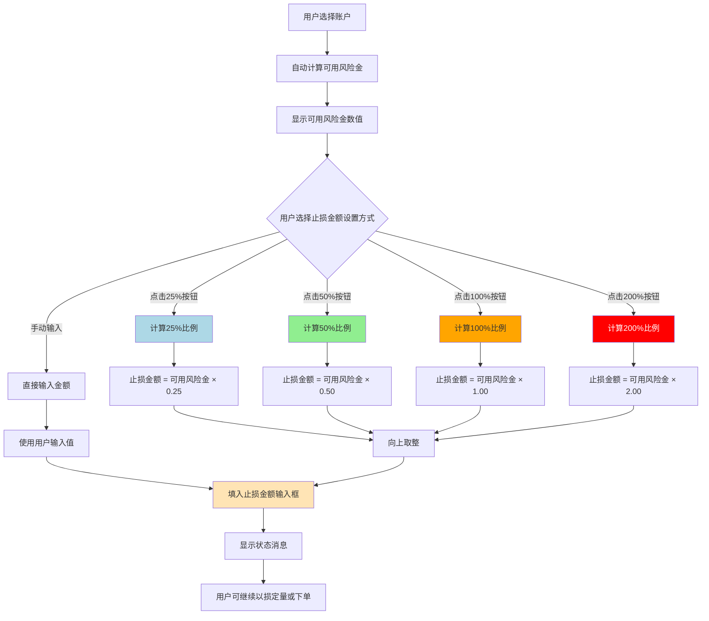

# 可用风险金和止损金额功能完整实现总结

## 📅 更新日期
2024年12月19日

## 🎯 本次更新概述

本次更新实现了两个重要功能：
1. **可用风险金计算功能** - 解决输入框显示空白问题，增加持仓实际盈亏计算
2. **止损金额比例按钮功能** - 增加4个快速设置按钮，支持按比例填写止损金额

---

## 📊 功能一：可用风险金计算功能

### 🔍 问题描述
- 可用风险金输入框显示空白
- 需要根据切换的账户自动计算填写
- 需要计算持仓的"实际盈亏"并纳入计算

### ✅ 解决方案

#### 1. 新增专用属性
```csharp
// 可用风险金
[ObservableProperty]
private decimal _availableRiskCapital = 0;
```

#### 2. 实际盈亏计算逻辑
```csharp
// 多单实际盈亏 = (进场价 - 止损触发价) * 数量
realizedPnl = (position.EntryPrice - stopOrder.StopPrice) * Math.Abs(position.PositionAmt);

// 空单实际盈亏 = (止损触发价 - 进场价) * 数量  
realizedPnl = (stopOrder.StopPrice - position.EntryPrice) * Math.Abs(position.PositionAmt);
```

#### 3. 完整计算公式
```
可用风险金 = (账户权益 + 持仓实际盈亏) ÷ 风险机会次数
```

#### 4. 自动触发条件
- 账户切换时自动计算
- 数据刷新完成后自动计算
- 手动点击"计算"按钮

#### 5. 界面绑定更新
```xml
<TextBox Text="{Binding AvailableRiskCapital, StringFormat=F0}" 
         IsReadOnly="True" Height="28" FontSize="12" Padding="8,6" 
         Background="LightGray"/>
```

### 🔍 详细状态显示
```
✅ 可用风险金: 1250U (调整后权益12502.50 ÷ 风险次数10)
🔍 持仓实际盈亏计算:
  💰 BTCUSDT 多单: 进场96500.0000, 止损91675.0000, 实际盈亏-48.25U
  💰 ETHUSDT 空单: 进场3450.0000, 止损3588.0000, 实际盈亏-13.80U
📊 总实际盈亏: -62.05U
```

---

## 🎮 功能二：止损金额比例按钮功能

### 🔍 需求描述
在止损金额输入框旁增加4个按钮（25%、50%、100%、200%），分别代表给止损金额填写对应比例的金额。

### ✅ 实现方案

#### 1. 新增命令方法
```csharp
[RelayCommand]
private void SetStopLossAmountRatio(object parameter)
{
    if (parameter is string ratioStr && decimal.TryParse(ratioStr, out decimal ratio))
    {
        if (AvailableRiskCapital <= 0)
        {
            StatusMessage = "请先计算可用风险金";
            return;
        }

        var amount = AvailableRiskCapital * (ratio / 100);
        StopLossAmount = Math.Ceiling(amount); // 向上取整
        
        StatusMessage = $"止损金额已设置为可用风险金的{ratio}%: {StopLossAmount:F0}U";
    }
}
```

#### 2. 界面布局修改
```xml
<DockPanel Grid.Row="1" Grid.Column="0" Margin="0,0,4,4">
    <TextBlock Text="止损金额:" FontWeight="Bold" FontSize="12" 
              DockPanel.Dock="Left" VerticalAlignment="Center" Width="62"/>
    <StackPanel DockPanel.Dock="Right" Orientation="Horizontal" Margin="2,0,0,0">
        <Button Content="25%" Command="{Binding SetStopLossAmountRatioCommand}" 
               CommandParameter="25" Width="22" Height="28" Padding="0" FontSize="9" 
               Background="LightBlue" Foreground="Black" FontWeight="Bold"
               ToolTip="设置为可用风险金的25%"/>
        <Button Content="50%" Command="{Binding SetStopLossAmountRatioCommand}" 
               CommandParameter="50" Width="22" Height="28" Padding="0" FontSize="9"
               Background="LightGreen" Foreground="Black" FontWeight="Bold"
               ToolTip="设置为可用风险金的50%"/>
        <Button Content="100%" Command="{Binding SetStopLossAmountRatioCommand}" 
               CommandParameter="100" Width="25" Height="28" Padding="0" FontSize="8"
               Background="Orange" Foreground="Black" FontWeight="Bold"
               ToolTip="设置为可用风险金的100%"/>
        <Button Content="200%" Command="{Binding SetStopLossAmountRatioCommand}" 
               CommandParameter="200" Width="25" Height="28" Padding="0" FontSize="8"
               Background="Red" Foreground="White" FontWeight="Bold"
               ToolTip="设置为可用风险金的200%"/>
        <Button Content="以损定量" Command="{Binding CalculateQuantityFromLossCommand}" 
               Width="56" Height="28" Padding="0" FontSize="10"
               Background="LightGreen" Foreground="Black" FontWeight="Bold"/>
    </StackPanel>
    <TextBox Text="{Binding StopLossAmount}" Height="28" FontSize="12" Padding="8,6"
            ToolTip="预计止损金额，可手动输入或使用比例按钮快速设置"/>
</DockPanel>
```

#### 3. 按钮设计
| 按钮 | 颜色 | 策略类型 | 适用场景 |
|------|------|----------|----------|
| **25%** | 浅蓝色 | 保守型 | 新手或不确定市场方向 |
| **50%** | 浅绿色 | 平衡型 | 有经验的交易者 |
| **100%** | 橙色 | 积极型 | 对市场判断有信心 |
| **200%** | 红色 | 激进型 | 极度看好的机会 |

---

## 🔄 功能流程图



---

## 📝 代码修改详情

### 文件修改列表

#### 1. ViewModels/MainViewModel.Trading.cs
- **新增属性**: `AvailableRiskCapital` - 存储可用风险金
- **修改方法**: `CalculateMaxRiskCapital()` - 增加持仓实际盈亏计算
- **新增命令**: `SetStopLossAmountRatioCommand` - 比例按钮命令
- **修改触发**: `OnSelectedAccountChanged()` - 账户切换时自动计算

#### 2. ViewModels/MainViewModel.Data.cs  
- **修改方法**: `RefreshAccountDataWithSelectionPreservation()` - 数据刷新后自动计算

#### 3. MainWindow.xaml
- **修改绑定**: 可用风险金TextBox绑定到新属性
- **界面重构**: 止损金额区域增加4个比例按钮
- **移除限制**: 止损金额TextBox改为可编辑

---

## 🎮 完整使用流程

### 第一步：账户和风险金设置
1. 选择交易账户
2. 系统自动计算可用风险金（包含持仓实际盈亏）
3. 可用风险金输入框显示计算结果

### 第二步：止损金额设置
1. **方式一**: 点击比例按钮快速设置
   - 25% → 保守策略
   - 50% → 平衡策略  
   - 100% → 积极策略
   - 200% → 激进策略

2. **方式二**: 手动输入具体金额

### 第三步：后续操作
1. 使用"以损定量"计算交易数量
2. 设置其他交易参数
3. 执行下单操作

---

## 📊 计算示例

### 假设条件
- 账户权益：10000U
- 风险机会次数：10
- 持仓实际盈亏：-250U

### 计算过程
```
调整后权益 = 10000 + (-250) = 9750U
可用风险金 = 9750 ÷ 10 = 975U
```

### 比例设置结果
- 点击 **25%**: 止损金额 = 975 × 0.25 = 244U
- 点击 **50%**: 止损金额 = 975 × 0.50 = 488U
- 点击 **100%**: 止损金额 = 975 × 1.00 = 975U
- 点击 **200%**: 止损金额 = 975 × 2.00 = 1950U

---

## 🔧 技术特性

### 数据安全
- 可用风险金为只读，防止误修改
- 输入验证和异常处理
- 前置条件检查

### 性能优化
- 自动触发计算，减少手动操作
- 缓存计算结果
- 异步处理避免界面卡顿

### 用户体验
- 实时状态反馈
- 详细的计算过程显示
- 直观的按钮颜色编码
- 丰富的工具提示

---

## 🚀 后续增强建议

### 短期优化
1. 添加历史比例使用统计
2. 支持自定义比例设置
3. 风险级别预警功能

### 长期规划
1. 多账户风险金统一管理
2. 智能风险比例推荐
3. 交易策略模板保存
4. 风险报告生成

---

## 📋 测试验证

### 功能测试项目
- [x] 账户切换时可用风险金自动计算
- [x] 数据刷新时可用风险金自动更新
- [x] 持仓实际盈亏正确计算
- [x] 4个比例按钮功能正常
- [x] 手动输入止损金额功能
- [x] 状态消息正确显示
- [x] 界面布局美观合理

### 边界测试
- [x] 无持仓时的计算处理
- [x] 无止损委托时的提示
- [x] 可用风险金为0时的按钮处理
- [x] 异常情况的错误处理

---

## 📞 技术支持

如有问题或建议，请参考：
- `可用风险金计算功能实现说明.md`
- `止损金额比例按钮功能说明.md`
- 项目日志文件中的详细运行信息

---

**文档版本**: v1.0  
**最后更新**: 2024年12月19日  
**状态**: ✅ 开发完成，已测试验证 