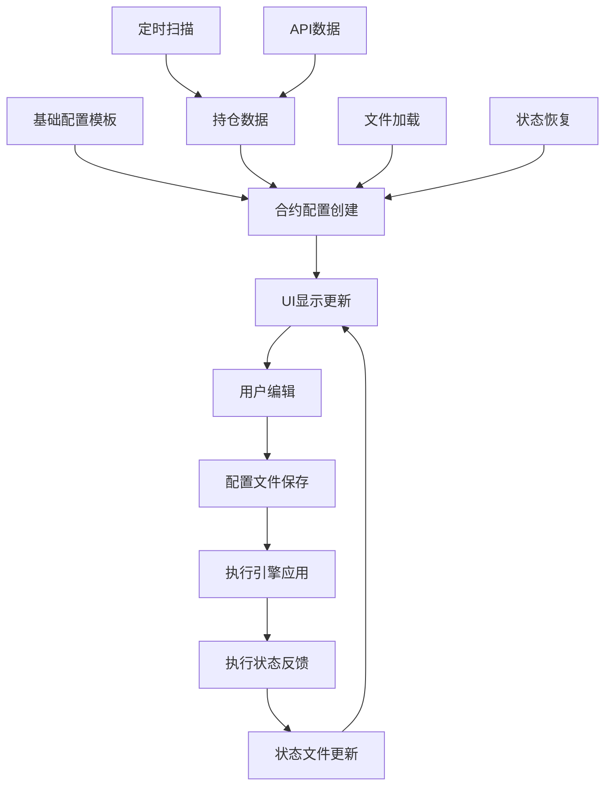

# 合约配置系统详解

## 📋 概览

合约配置系统是自动盯盘的核心配置管理模块，负责管理每个合约的保本、推仓、保盈等参数设置，以及执行状态的维护。

## 🖥️ 1. 合约配置相关的UI界面

### 1.1 主要UI组件

#### AutoMonitorDashboard.xaml (主控制面板)
```
功能：合约监控总览和控制
├── 📊 合约列表显示 (DataGrid)
├── 🎛️ 启动/停止监控按钮
├── ⚙️ 配置管理按钮
├── 📈 实时状态显示
├── 🔄 手动刷新按钮
└── 📋 日志显示区域
```

#### AutoMonitorConfigWindowSimple.xaml (配置管理窗口)
```
功能：详细的合约配置管理
├── 📋 合约配置列表 (DataGrid)
│   ├── 合约名称 (Symbol_PositionSide)
│   ├── 基础配置选择
│   ├── 保本状态显示
│   ├── 推仓状态显示 (多档位)
│   ├── 保盈状态显示 (多档位)
│   └── 启用/禁用开关
├── 🎯 配置操作按钮
│   ├── 刷新配置
│   ├── 保存配置
│   ├── 重置状态
│   └── 导入/导出
└── 📊 配置详情面板
    ├── 保本配置编辑
    ├── 推仓阶梯配置
    └── 保盈阶梯配置
```

### 1.2 UI数据绑定结构

#### ContractMonitorConfigViewModel
```csharp
public class ContractMonitorConfigViewModel : INotifyPropertyChanged
{
    // 基础信息
    public string ContractName { get; set; }           // 合约名称 (如: BTCUSDT_LONG)
    public string Symbol { get; set; }                 // 交易对 (如: BTCUSDT)
    public string PositionSide { get; set; }           // 持仓方向 (LONG/SHORT)
    public string BaseConfigName { get; set; }         // 基础配置名称 (如: 稳健)
    public bool IsEnabled { get; set; }                // 是否启用监控
    
    // 实时数据
    public decimal CurrentPnl { get; set; }            // 当前浮盈
    public decimal PositionSize { get; set; }          // 持仓数量
    public decimal EntryPrice { get; set; }            // 开仓价格
    public decimal CurrentPrice { get; set; }          // 当前价格
    
    // 配置状态
    public bool IsBreakEvenEnabled { get; set; }       // 保本功能启用
    public bool IsAddPositionEnabled { get; set; }     // 推仓功能启用  
    public bool IsProfitProtectionEnabled { get; set; } // 保盈功能启用
    
    // 执行状态 (动态属性)
    public string BreakEvenStatus { get; set; }        // 保本状态: "未触发"/"已执行"
    public string Push1Status { get; set; }            // 推仓档1状态
    public string Push2Status { get; set; }            // 推仓档2状态
    // ... Push3-Push10
    public string Profit1Status { get; set; }          // 保盈档1状态
    public string Profit2Status { get; set; }          // 保盈档2状态
    // ... Profit3-Profit10
    
    // 颜色状态 (UI显示)
    public SolidColorBrush BreakEvenColor { get; set; }
    public SolidColorBrush Push1Color { get; set; }
    // ... 其他颜色属性
}
```

### 1.3 UI状态显示逻辑

#### 状态颜色映射
```csharp
// 状态颜色定义
private readonly Dictionary<string, SolidColorBrush> _statusColors = new()
{
    ["未触发"] = new SolidColorBrush(Colors.Gray),
    ["已触发"] = new SolidColorBrush(Colors.Orange), 
    ["已执行"] = new SolidColorBrush(Colors.Green),
    ["模拟执行"] = new SolidColorBrush(Colors.Blue),
    ["执行失败"] = new SolidColorBrush(Colors.Red),
    ["√"] = new SolidColorBrush(Colors.Green),        // 简化显示
    ["×"] = new SolidColorBrush(Colors.Red)           // 简化显示
};

// 状态文本映射
private readonly Dictionary<TriggerExecutionStatus, string> _statusTexts = new()
{
    [TriggerExecutionStatus.NotTriggered] = "未触发",
    [TriggerExecutionStatus.Triggered] = "已触发", 
    [TriggerExecutionStatus.Executed] = "√",          // UI简化显示
    [TriggerExecutionStatus.Failed] = "×"
};
```

## 📁 2. 合约配置相关的文件

### 2.1 主要配置文件

#### contract_configs.json (合约配置文件)
```
存储位置: %APPDATA%\BinanceFuturesTrader\AutoMonitor\contract_configs.json
功能: 保存每个合约的具体配置参数和执行状态
```

```json
{
  "BTCUSDT_LONG": {
    "symbol": "BTCUSDT",
    "positionSide": "LONG",
    "baseConfigName": "稳健",
    "isEnabled": true,
    "useIndependentConfig": false,
    "lastUpdateTime": "2024-01-15T10:30:00",
    
    // 保本配置
    "breakEvenConfig": {
      "isEnabled": true,
      "triggerProfitAmount": 100.0,
      "isExecuted": false,
      "executionTime": null,
      "executionMessage": null
    },
    
    // 推仓配置  
    "addPositionConfig": {
      "isEnabled": true,
      "tiers": [
        {
          "tierIndex": 1,
          "isEnabled": true,
          "triggerProfitAmount": 150.0,
          "riskMultiplier": 1.5,
          "stopLossRatio": 0.02,
          "isExecuted": false,
          "executionTime": null
        },
        {
          "tierIndex": 2,
          "isEnabled": true, 
          "triggerProfitAmount": 300.0,
          "riskMultiplier": 2.0,
          "stopLossRatio": 0.02,
          "isExecuted": false,
          "executionTime": null
        }
        // ... 更多阶梯
      ]
    },
    
    // 保盈配置
    "profitProtectionConfig": {
      "isEnabled": true,
      "tiers": [
        {
          "tierIndex": 1,
          "isEnabled": true,
          "triggerProfitAmount": 200.0, 
          "protectionAmount": 100.0,
          "isExecuted": false,
          "executionTime": null
        }
        // ... 更多阶梯
      ]
    }
  }
}
```

#### AutoMonitorConfigs.json (基础配置模板)
```
存储位置: %APPDATA%\BinanceFuturesTrader\AutoMonitorConfigs.json
功能: 保存基础配置模板 (如: 稳健、激进、保守等)
```

```json
{
  "configs": [
    {
      "name": "稳健",
      "description": "适合稳健型投资者的配置",
      "isEnabled": true,
      "scanIntervalSeconds": 5,
      
      "breakEvenConfig": {
        "isEnabled": true,
        "triggerProfitAmount": 100.0,
        "description": "浮盈100U时保本"
      },
      
      "addPositionConfig": {
        "isEnabled": true,
        "tiers": [
          {
            "tierIndex": 1,
            "isEnabled": true,
            "triggerProfitAmount": 150.0,
            "riskMultiplier": 1.0,
            "stopLossRatio": 0.02,
            "description": "浮盈150U时加仓1倍风险金"
          }
          // ... 更多阶梯模板
        ]
      }
    }
  ]
}
```

#### position_profiles.json (持仓档案状态)
```
存储位置: %APPDATA%\BinanceFuturesTrader\AutoMonitor\position_profiles.json  
功能: 保存执行状态和历史记录
```

#### contract_monitoring_states.json (监控状态文件)
```
存储位置: %APPDATA%\BinanceFuturesTrader\AutoMonitor\contract_monitoring_states.json
功能: 保存实时监控状态和执行记录
```

### 2.2 文件读写操作

#### 配置文件加载
```csharp
// AutoMonitorConfigWindowSimple.xaml.cs
private async Task LoadContractConfigsAsync()
{
    try
    {
        var filePath = GetContractConfigsFilePath();
        if (File.Exists(filePath))
        {
            var json = await File.ReadAllTextAsync(filePath);
            var configs = JsonSerializer.Deserialize<Dictionary<string, ContractMonitorConfigViewModel>>(json);
            
            // 更新UI集合
            ContractMonitors.Clear();
            foreach (var config in configs.Values)
            {
                ContractMonitors.Add(config);
            }
        }
    }
    catch (Exception ex)
    {
        _logger.LogError(ex, "加载合约配置失败");
    }
}
```

#### 配置文件保存
```csharp
private async Task SaveContractConfigsToFileAsync()
{
    try
    {
        var configs = ContractMonitors.ToDictionary(
            c => c.ContractName,
            c => c
        );
        
        var json = JsonSerializer.Serialize(configs, new JsonSerializerOptions 
        { 
            WriteIndented = true,
            PropertyNameCaseInsensitive = true
        });
        
        var filePath = GetContractConfigsFilePath();
        await File.WriteAllTextAsync(filePath, json);
        
        _logger.LogInformation($"✅ 已保存 {configs.Count} 个合约配置");
    }
    catch (Exception ex)
    {
        _logger.LogError(ex, "保存合约配置失败");
    }
}
```

## ⚙️ 3. 影响合约配置的因素

### 3.1 直接影响因素

#### 3.1.1 基础配置模板选择
```
影响范围: 所有配置参数的默认值
影响机制: 
├── 用户选择基础配置 (如: 稳健、激进)
├── 系统加载对应模板参数
├── 应用到具体合约配置
└── 用户可以进一步个性化调整

配置来源:
├── AutoMonitorConfigs.json (基础模板)
└── 用户在UI中的选择
```

#### 3.1.2 持仓信息变化
```
影响范围: 合约配置的创建、更新、删除
影响机制:
├── 新开仓 → 自动创建合约配置
├── 持仓变化 → 更新持仓数量、浮盈等
├── 平仓 → 从配置列表中移除
└── 持仓方向变化 → 重新创建配置

数据来源:
├── 币安API持仓数据 (实时)
└── BinanceService.GetPositionsAsync()
```

#### 3.1.3 用户手动配置
```
影响范围: 特定合约的个性化设置
影响机制:
├── UI界面直接编辑
├── 独立配置开关
├── 参数微调
└── 启用/禁用功能

操作界面:
├── AutoMonitorConfigWindowSimple.xaml
└── 配置详情编辑面板
```

### 3.2 间接影响因素

#### 3.2.1 执行状态反馈
```
影响范围: 配置的IsExecuted标记和状态显示
影响机制:
├── 自动盯盘执行成功 → 更新IsExecuted = true
├── 执行失败 → 记录失败原因
├── 状态变化 → 更新UI显示
└── 重复执行防护

状态来源:
├── AutoMonitorExecutionEngine 执行结果
├── TradingExecutionService 交易结果
└── StateManager 状态管理
```

#### 3.2.2 文件系统操作
```
影响范围: 配置的持久化和恢复
影响机制:
├── 程序启动 → 加载保存的配置
├── 配置变更 → 实时保存到文件
├── 状态变化 → 更新配置文件
└── 备份恢复 → 批量配置更新

文件操作:
├── 启动时批量加载
├── 变更时实时保存
├── 定期备份
└── 异常恢复
```

#### 3.2.3 网络和API状态
```
影响范围: 配置的有效性和执行模式
影响机制:
├── API连接状态 → 影响实盘/模拟模式
├── 网络延迟 → 影响实时数据更新
├── API限制 → 影响执行频率
└── 错误恢复 → 影响配置状态

状态检查:
├── BinanceService 连接状态
├── IsSimulationMode() 检查
└── API错误处理
```

### 3.3 配置更新触发时机

#### 3.3.1 实时触发
```
1. 用户UI操作
   ├── 修改配置参数 → 立即保存
   ├── 切换启用状态 → 立即生效
   └── 选择基础配置 → 立即应用

2. 持仓数据变化
   ├── 新持仓检测 → 自动创建配置
   ├── 持仓平仓 → 自动移除配置
   └── 浮盈变化 → 更新实时显示

3. 执行状态变化
   ├── 保本执行成功 → 更新状态标记
   ├── 推仓执行成功 → 更新阶梯状态
   └── 保盈执行成功 → 更新保盈状态
```

#### 3.3.2 定期触发
```
1. 定时扫描 (5秒间隔)
   ├── 刷新持仓数据
   ├── 同步配置状态
   └── 检查配置有效性

2. 状态同步 (启动时)
   ├── 加载所有配置文件
   ├── 恢复执行状态
   └── 重建UI显示

3. 备份保存 (关闭时)
   ├── 保存所有配置更改
   ├── 更新状态文件
   └── 清理临时数据
```

## 🔄 4. 配置数据流转图



## 🎯 5. 配置管理最佳实践

### 5.1 配置创建流程
```
1. 检测新持仓
2. 选择合适的基础配置模板
3. 应用模板参数到具体合约
4. 允许用户个性化调整
5. 保存配置到文件
6. 启用自动监控
```

### 5.2 配置同步机制
```
1. UI变更 → 立即同步到内存
2. 内存变更 → 立即保存到文件
3. 文件变更 → 定期同步到UI
4. 状态变更 → 实时更新显示
```

### 5.3 配置冲突处理
```
1. 文件 vs 内存冲突 → 以最新修改时间为准
2. UI vs 后台冲突 → 以后台执行结果为准
3. 用户 vs 系统冲突 → 提示用户确认
4. 配置 vs 持仓冲突 → 自动调整配置
```

这个配置系统确保了合约配置的完整性、一致性和实时性，为自动盯盘功能提供了可靠的配置管理基础。 