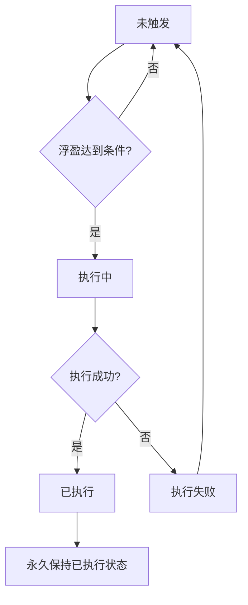
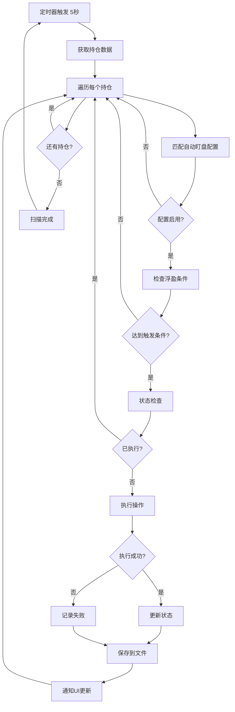

# 自动盯盘工作流程详解

## 📋 概览

自动盯盘系统是一个基于定时扫描的智能交易管理系统，主要负责监控持仓浮盈变化，并在达到预设条件时自动执行保本、推仓、保盈等操作。

## 🔄 1. 定时程序的工作内容

### 1.1 扫描周期
- **默认间隔**：5秒
- **可配置范围**：5-60秒
- **触发方式**：System.Timers.Timer

### 1.2 每次扫描的工作步骤

#### Step 1: 基础检查
```
🔍 检查服务运行状态
🔍 检查网络连接状态
🔍 检查API配置有效性
🔍 验证执行环境（模拟/实盘）
```

#### Step 2: 持仓数据获取
```
📊 调用币安API获取最新持仓
📊 更新持仓数量、浮盈、标记价格
📊 计算实时PnL变化
📊 同步持仓状态到本地档案
```

#### Step 3: 合约配置匹配
```
🎯 遍历所有活跃持仓
🎯 匹配对应的自动盯盘配置
🎯 检查配置是否启用
🎯 验证配置完整性
```

#### Step 4: 条件检查与执行
```
💰 浮盈条件比对
💰 冷却期检查
💰 重复执行防护
💰 触发条件满足时执行操作
```

#### Step 5: 状态更新与持久化
```
💾 更新执行状态
💾 记录操作历史
💾 保存到文件
💾 通知UI更新
```

### 1.3 扫描输出示例
```
[22:57:51] [INFO] ⏰ 定时器触发，开始扫描
[22:57:51] [INFO] 🔍【浮盈比对】TONUSDT_BOTH: 当前浮盈 1.62U
[22:57:51] [INFO] 🔍【配置检查】TONUSDT_BOTH: 配置=稳健, 启用=True
[22:57:51] [INFO] 🔍【执行引擎调用】TONUSDT_BOTH: 开始调用ExecuteContractMonitoringAsync
[22:57:51] [INFO] ✅ 扫描完成 - 已处理 3 个持仓
```

## 🔄 2. 状态如何变化

### 2.1 执行状态生命周期



### 2.2 具体状态变化

#### 保本状态变化
```
初始状态: 
├── IsTriggered: false
├── ExecutionStatus: "未触发"
└── IsExecuted: false

触发条件满足时:
├── 浮盈 >= 触发金额
└── 状态检查通过

执行成功后:
├── IsTriggered: true
├── ExecutionStatus: "已执行"/"模拟执行"
├── IsExecuted: true
├── TriggerTime: DateTime.Now
├── TriggerPnl: 当前浮盈
└── ExecutionTime: DateTime.Now
```

#### 推仓状态变化（多阶梯）
```
阶梯1状态:
├── TierIndex: 1
├── IsTriggered: false → true
├── ExecutionStatus: "未触发" → "已执行"
└── IsExecuted: false → true

阶梯2状态:
├── TierIndex: 2  
├── IsTriggered: false (等待更高浮盈)
├── ExecutionStatus: "未触发"
└── IsExecuted: false

... (依次类推)
```

### 2.3 状态检查逻辑

#### 三重状态检查机制
```csharp
// 检查1: 配置层状态
config.IsExecuted

// 检查2: 状态管理器状态  
_stateManager.IsOperationExecuted(symbol, positionSide, operationType)

// 检查3: 档案层状态
profile.BreakEvenState.IsTriggered && 
profile.BreakEvenState.ExecutionStatus == "已执行"

// 防重复执行: 任一为true则跳过
if (check1 || check2 || check3) {
    跳过执行
}
```

## 💾 3. 文件读写时机

### 3.1 文件存储位置
```
Windows: %APPDATA%\BinanceFuturesTrader\AutoMonitor\
├── position_profiles.json          // 持仓档案状态
├── execution_history.json          // 执行历史记录
├── contract_configs.json          // 合约配置文件
└── contract_monitoring_states.json // 监控状态文件
```

### 3.2 文件读取时机

#### 启动时读取
```
✅ 系统启动时
└── 读取所有配置和状态文件
    ├── LoadPositionProfiles()      // 恢复持仓档案
    ├── LoadExecutionHistory()      // 恢复执行历史
    ├── LoadContractConfigs()       // 加载合约配置
    └── LoadMonitoringStates()      // 恢复监控状态
```

#### 状态同步时读取
```
✅ 每次执行前
└── 检查最新状态文件
    ├── 防止多进程冲突
    ├── 确保状态一致性
    └── 避免重复执行
```

### 3.3 文件写入时机

#### 立即写入（实时保存）
```
✅ 每次成功执行后
└── 立即保存状态
    ├── _stateManager.SaveToPersistence()
    ├── _profileService.UpdateProfileAsync()
    └── SaveContractConfigsToFile()

执行时序:
1. 执行交易操作
2. 更新内存状态
3. 立即写入文件  ← 关键时机
4. 通知UI更新
```

#### 批量写入（定期保存）
```
✅ 服务停止时
└── 统一保存所有状态
    ├── 防止数据丢失
    ├── 确保完整性
    └── 清理临时状态
```

### 3.4 文件格式示例

#### position_profiles.json
```json
{
  "BTCUSDT_LONG": {
    "symbol": "BTCUSDT",
    "positionSide": "LONG",
    "isActive": true,
    "triggerRecords": {
      "BreakEven": {
        "isExecuted": true,
        "triggerTime": "2024-01-15T10:30:00",
        "triggerPnl": 150.50
      },
      "AddPosition_1": {
        "isExecuted": true,
        "triggerTime": "2024-01-15T10:35:00", 
        "triggerPnl": 300.25
      }
    }
  }
}
```

## 🔄 4. 下单与委托的处理细节

### 4.1 下单流程

#### 模拟模式下单
```
🎯 IsSimulationMode() 检查
└── API配置无效时进入
    ├── 直接返回成功结果
    ├── 不调用真实API
    ├── 状态标记为"模拟执行"
    └── 继续后续状态管理
```

#### 实盘模式下单
```
🚀 API配置有效时
└── 真实下单流程
    ├── 获取实时价格
    ├── 计算精确数量
    ├── 应用交易规则限制
    ├── 调用币安API下单
    ├── 等待订单确认
    └── 处理API返回结果
```

### 4.2 推仓下单详细流程

#### Step 1: 参数计算
```
💰 计算加仓市值
├── 公式: (风险金倍数 × 单笔风险金) ÷ 止损比例
├── 风险金倍数: tier.RiskMultiplier
├── 止损比例: tier.StopLossRatio
└── 单笔风险金: 账户净值 ÷ 风险金次数

📊 计算加仓数量
├── 加仓数量 = 总市值 ÷ 当前价格
├── 精度调整: AdjustQuantityToPrecision()
└── 最小量检查: >= tradingRules.MinQuantity
```

#### Step 2: 下单执行
```
🔧 模拟模式:
└── ExecuteSimulatedAddPosition()
    ├── 模拟计算止损价
    ├── 更新阶梯状态
    ├── 标记"模拟执行"
    └── 返回成功结果

🚀 实盘模式:
└── PlaceMarketOrderAsync()
    ├── 构建下单参数
    ├── 调用币安API
    ├── 等待订单确认
    └── 获取订单结果
```

#### Step 3: 后续处理
```
✅ 下单成功后:
├── 等待1秒确认
├── 获取更新后持仓
├── 计算新的止损价格
├── 更新/撤销旧止损委托
└── 创建新止损委托
```

### 4.3 委托管理详细流程

#### 保本止损委托
```
🛡️ 保本触发时:
├── 计算保本价格 = 平均开仓价
├── 设置止损委托类型 = STOP_MARKET  
├── 委托数量 = 当前持仓数量
└── 提交止损委托订单

🔧 委托参数:
├── symbol: 合约名称
├── side: SELL/BUY (与持仓相反)
├── type: STOP_MARKET
├── quantity: 持仓数量
├── stopPrice: 保本价格
└── timeInForce: GTC
```

#### 推仓后止损委托更新
```
🔄 推仓成功后:
├── 撤销旧的止损委托
├── 计算新的止损价格
├── 根据保盈目标计算
└── 提交新的止损委托

📊 新止损价计算:
├── 考虑加仓后的平均成本
├── 考虑保盈目标要求
├── 确保风险控制合理
└── 应用价格精度限制
```

### 4.4 API调用保护机制

#### 限流控制
```
🚫 API限流保护:
├── 最小请求间隔: 200ms
├── 串行执行: SemaphoreSlim(1,1)
├── 错误恢复模式
└── IP限制自动检测
```

#### 错误处理
```
❌ API错误处理:
├── 网络错误 → 自动重试
├── 签名错误 → 记录并跳过
├── 限流错误 → 等待后重试
├── IP限制 → 自动切换模拟模式
└── 其他错误 → 降级到模拟数据
```

## 🔄 5. 完整工作流程图



## 💡 关键设计理念

1. **防重复执行**：三重状态检查确保同一操作不会重复执行
2. **实时持久化**：每次执行后立即保存状态，防止数据丢失
3. **模拟/实盘双模式**：根据API配置自动切换执行模式
4. **错误恢复**：API失败时自动降级，保证系统稳定运行
5. **精确计算**：严格按照交易规则计算数量和价格
6. **风险控制**：多层风险检查，确保交易安全 