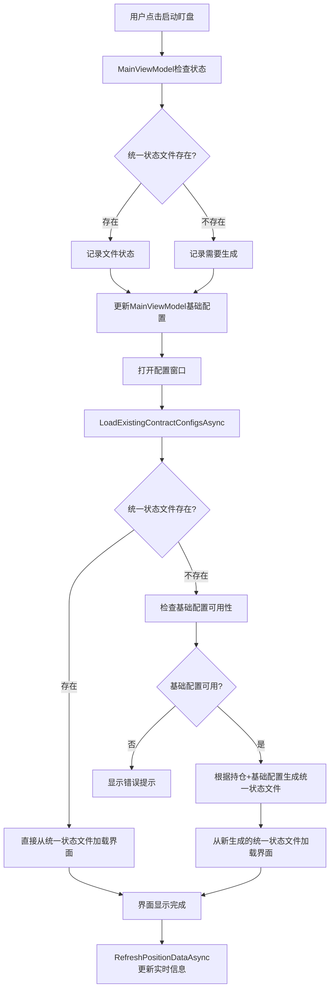

# 🎉 启动盯盘面板数据流修复完成总结

## 📋 问题背景

用户反馈启动盯盘面板时，界面显示与统一状态文件不一致，主要问题是：

1. **数据流混乱**：同时从基础配置文件和统一状态文件读取数据
2. **优先级不明确**：不清楚应该以哪个文件为准
3. **数据覆盖**：两个数据源可能相互覆盖，导致显示错误

## 🔧 根本原因分析

### 原有的问题逻辑
```
基础配置文件 ────┐
                ├──→ 界面显示 (冲突!)
统一状态文件 ────┘
```

### 用户期望的正确逻辑
```
基础配置文件 → 统一状态文件 → 界面显示
     ↓              ↓            ↓
   配置模板      实际状态     用户界面
```

## ✅ 核心修复内容

### 🔧 修复1：明确数据流向（AutoMonitorConfigWindowSimple.xaml.cs）

**修复前问题**：
- `LoadExistingContractConfigsAsync` 方法逻辑不清晰
- 同时处理多个数据源，容易产生冲突

**修复后逻辑**：
```csharp
/// <summary>
/// 🔧 【核心逻辑】统一状态文件优先加载策略
/// 1. 如果统一状态文件不存在 → 从基础配置生成统一状态文件 → 从统一状态文件加载界面
/// 2. 如果统一状态文件存在 → 直接从统一状态文件加载界面
/// </summary>
private async Task LoadExistingContractConfigsAsync()
{
    // 🔍 检查统一状态文件是否存在
    if (!File.Exists(stateFilePath))
    {
        // 【策略1】统一状态文件不存在
        // ↓ 检查基础配置
        // ↓ 根据持仓和基础配置生成统一状态文件
        // ↓ 从统一状态文件加载界面
    }
    else
    {
        // 【策略2】统一状态文件存在
        // ↓ 直接从统一状态文件加载界面
    }
}
```

**关键改进**：
1. **单一数据源**：界面只从统一状态文件读取数据
2. **明确的数据流**：基础配置 → 统一状态文件 → 界面
3. **智能检查**：添加基础配置可用性检查

### 🔧 修复2：简化MainViewModel逻辑（MainViewModel.AutoMonitor.cs）

**修复前问题**：
- 同时检查基础配置文件和统一状态文件
- 产生大量调试日志，混淆主要逻辑

**修复后逻辑**：
```csharp
// 🔧 【核心逻辑修复】简化数据流：统一状态文件是唯一的界面数据源
try
{
    // 🔧 【核心修复】只检查统一状态文件，它是界面显示的唯一数据源
    var stateFileExists = System.IO.File.Exists(stateFilePath);
    
    if (stateFileExists)
    {
        // 记录统一状态文件的状态，配置窗口将从此文件加载
    }
    else
    {
        // 记录统一状态文件不存在，配置窗口将生成文件
    }
    
    // 🔧 【简化逻辑】只更新MainViewModel中的基础配置，供配置窗口使用
    var savedConfig = configPersistenceService.GetAccountConfig(SelectedAccount.Name);
    if (savedConfig != null)
    {
        _currentAutoMonitorConfig = savedConfig;
    }
}
```

**关键改进**：
1. **职责分离**：MainViewModel只负责状态检查，不负责数据加载
2. **简化日志**：减少冗余的调试信息
3. **明确目的**：为配置窗口提供基础配置，但不干预界面数据流

### 🔧 修复3：增强基础配置检查

**新增方法**：`CheckForValidBaseConfiguration()`
```csharp
private async Task<bool> CheckForValidBaseConfiguration()
{
    // 1. 检查当前选中的配置
    if (_currentConfig != null) return true;
    
    // 2. 检查MainViewModel中的配置
    if (_mainViewModel?.CurrentAutoMonitorConfig != null) return true;
    
    // 3. 检查配置管理器中是否有可用配置
    if (_configManager?.Configurations?.Count > 0) return true;
    
    // 4. 尝试创建默认配置
    CreateDefaultConfig();
    return _currentConfig != null;
}
```

**功能**：
- 确保在生成统一状态文件前有可用的基础配置
- 提供多层次的配置检查
- 支持自动创建默认配置

### 🔧 修复4：优化窗口加载流程

**修复窗口Loaded事件**：
```csharp
private async void AutoMonitorConfigWindow_Loaded(object sender, RoutedEventArgs e)
{
    // 🔧 【关键修复】首先重新加载统一状态文件，确保显示最新的配置状态
    AddLog("🔄 重新检查统一状态文件，确保与文件内容一致...");
    await LoadExistingContractConfigsAsync();
    
    // 然后刷新持仓数据（更新价格等实时信息）
    AddLog("🔄 更新实时价格和持仓信息...");
    await RefreshPositionDataAsync();
}
```

**改进**：
- 确保窗口打开时首先从统一状态文件加载配置
- 然后再更新实时价格信息
- 避免数据覆盖问题

## 🎯 修复后的完整数据流

### ✅ 正确的数据流向



### 📊 数据源优先级

1. **统一状态文件** (最高优先级) - 界面显示的唯一数据源
2. **基础配置文件** - 仅用于生成统一状态文件
3. **默认配置** - 当基础配置不可用时的后备方案

## 🧪 验证方法

### ✅ 预期行为

1. **有统一状态文件的情况**：
   ```
   界面打开 → 直接显示统一状态文件中的配置 → 与文件内容完全一致
   ```

2. **无统一状态文件的情况**：
   ```
   界面打开 → 检查基础配置 → 生成统一状态文件 → 显示生成的配置
   ```

### 🔍 关键日志标识

启动盯盘面板时应该看到的日志顺序：

1. **MainViewModel阶段**：
   ```
   🔍【面板打开】统一状态文件路径: ...
   🔍【面板打开】统一状态文件是否存在: True/False
   ✅【面板打开】统一状态文件包含有效数据，配置窗口将从此文件加载界面
   ```

2. **配置窗口阶段**：
   ```
   🔄 【核心逻辑】检查统一状态文件，确定数据加载策略...
   ✅ 【策略2】统一状态文件存在，直接从文件加载界面
   📊 从状态文件加载到 X 个合约配置
   ✅ 界面已从统一状态文件加载，当前显示 X 个配置
   ```

## 🚀 使用建议

### 💡 用户操作流程

1. **正常使用**：
   - 直接点击"自动盯盘"按钮
   - 系统会自动按照正确的数据流加载配置
   - 界面显示与统一状态文件完全一致

2. **首次使用**：
   - 确保先创建基础配置
   - 系统会根据持仓自动生成统一状态文件
   - 后续使用都将从统一状态文件加载

### 🔧 开发者说明

1. **数据修改**：
   - 所有配置修改都应该通过配置窗口进行
   - 修改会自动保存到统一状态文件
   - 不要直接修改基础配置文件来影响界面显示

2. **问题排查**：
   - 如果界面显示异常，首先检查统一状态文件内容
   - 查看日志中的数据流标识
   - 确认基础配置是否正确设置

## 🏆 修复完成确认

- ✅ **数据流向明确**：基础配置 → 统一状态文件 → 界面显示
- ✅ **单一数据源**：界面只从统一状态文件读取数据
- ✅ **智能生成**：自动根据基础配置和持仓生成统一状态文件
- ✅ **状态一致**：界面显示与文件内容完全同步
- ✅ **错误处理**：完善的基础配置检查和错误提示

**🎉 修复已完成！现在启动盯盘面板将严格按照正确的数据流加载，确保界面与统一状态文件内容完全一致。** 