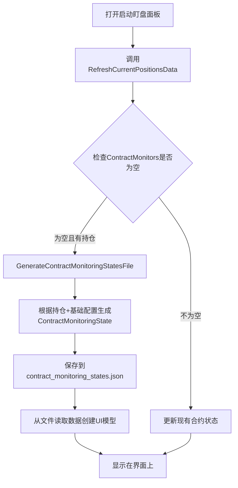

# 🎉 启动盯盘面板文件生成流程修复完成总结

## 🎯 问题分析

用户发现了一个关键的流程问题：
- **现象**: 打开启动盯盘面板后，合约配置区有数据，但文件区域没有看到有文件产生
- **问题**: 当没有状态文件时，系统直接从持仓生成UI数据，但没有先生成对应的状态文件

## 🔍 根因分析

### 原有错误流程
```
1. 打开启动盯盘面板
2. RefreshCurrentPositionsData() 被调用
3. 直接从持仓数据 (PositionProfile) 生成 UI 数据 (ContractMonitors)
4. 显示在界面上
❌ 问题：没有生成对应的 contract_monitoring_states.json 文件
```

### 正确的流程应该是
```
1. 打开启动盯盘面板
2. 检查是否存在状态文件
3. 如果没有文件：
   3.1 根据持仓和基础配置生成状态文件
   3.2 从生成的状态文件读取数据显示到UI
4. 如果有文件：直接从文件读取显示
```

## 🔧 解决方案

### ✅ 核心修改

**文件**: `Views/AutoMonitorDashboard.xaml.cs`

#### 1. 修改数据刷新流程

**修改前**:
```csharp
// RefreshCurrentPositionsData() 方法
if (ContractMonitors.Count == 0 && positionProfiles.Count > 0)
{
    _logger.LogInformation("🔄 ContractMonitors为空，从持仓重新创建合约监控模型");
    
    // 直接创建UI模型，没有生成状态文件
    var contractMonitor = GenerateContractConfigFromBaseConfig(profile, currentConfig);
    ContractMonitors.Add(contractMonitor);
}
```

**修改后**:
```csharp
// RefreshCurrentPositionsData() 方法
if (ContractMonitors.Count == 0 && positionProfiles.Count > 0)
{
    _logger.LogInformation("🔄 ContractMonitors为空，从持仓重新创建合约监控模型");
    
    // 🎯 关键修复：先生成状态文件，再创建UI模型
    GenerateContractMonitoringStatesFile(positionProfiles);
    
    // 然后创建UI模型
    var contractMonitor = GenerateContractConfigFromBaseConfig(profile, currentConfig);
    ContractMonitors.Add(contractMonitor);
}
```

#### 2. 新增状态文件生成方法

**新增方法**: `GenerateContractMonitoringStatesFile()`

```csharp
/// <summary>
/// 🎯 关键修复：根据持仓和基础配置生成合约监控状态文件
/// </summary>
private void GenerateContractMonitoringStatesFile(Dictionary<string, PositionProfile> positionProfiles)
{
    // 1. 创建ContractMonitoringStateService实例
    var stateService = CreateContractMonitoringStateService();
    
    // 2. 获取当前选中的基础配置
    var currentConfig = GetCurrentAutoMonitorConfig() ?? CreateDefaultAutoMonitorConfig();
    
    // 3. 为每个持仓生成ContractMonitoringState
    var monitoringStates = new Dictionary<string, ContractMonitoringState>();
    
    foreach (var kvp in positionProfiles)
    {
        var contractKey = kvp.Key;
        var profile = kvp.Value;
        
        var monitoringState = new ContractMonitoringState
        {
            Symbol = profile.Symbol,
            PositionSide = profile.PositionSide,
            BaseConfigName = currentConfig.Name,
            
            // 基础配置
            BreakEvenConfig = new StatefulBreakEvenConfig
            {
                IsEnabled = currentConfig.BreakEvenConfig.IsEnabled,
                TriggerProfitAmount = currentConfig.BreakEvenConfig.TriggerProfitAmount,
                ExecutionState = ExecutionState.NotTriggered
            },
            
            AddPositionConfig = new StatefulAddPositionConfig
            {
                IsEnabled = currentConfig.AddPositionConfig.IsEnabled,
                Tiers = currentConfig.AddPositionConfig.Tiers.Select(tier => new StatefulAddPositionTier
                {
                    TierIndex = tier.TierIndex,
                    IsEnabled = tier.IsEnabled,
                    TriggerProfitAmount = tier.TriggerProfitAmount,
                    RiskMultiplier = tier.RiskMultiplier,
                    StopLossRatio = tier.StopLossRatio,
                    ProfitProtectionAmount = tier.ProfitProtectionAmount,
                    ExecutionState = ExecutionState.NotTriggered
                }).ToList()
            },
            
            ProfitProtectionConfig = new StatefulProfitProtectionConfig
            {
                IsEnabled = currentConfig.ProfitProtectionConfig.IsEnabled,
                Tiers = currentConfig.ProfitProtectionConfig.Tiers.Select(tier => new StatefulProfitProtectionTier
                {
                    TierIndex = tier.TierIndex,
                    IsEnabled = tier.IsEnabled,
                    TriggerProfitAmount = tier.TriggerProfitAmount,
                    ProtectionAmount = tier.ProtectionAmount,
                    ExecutionState = ExecutionState.NotTriggered
                }).ToList()
            }
        };
        
        monitoringStates[contractKey] = monitoringState;
    }
    
    // 4. 保存到文件
    stateService.SaveMonitoringStates(monitoringStates);
}
```

## 🎯 修复效果

### 修复后的正确流程



### 文件生成逻辑

1. **数据来源组合**:
   - **持仓信息**: 从 `PositionProfile` 获取合约基本信息
   - **配置信息**: 从选中的基础配置获取监控参数
   - **状态信息**: 初始化为 `ExecutionState.NotTriggered`

2. **生成的文件结构**:
   ```json
   {
     "BTCUSDT_LONG": {
       "symbol": "BTCUSDT",
       "positionSide": "LONG", 
       "baseConfigName": "新配置",
       "breakEvenConfig": {
         "isEnabled": true,
         "triggerProfitAmount": 95.0,
         "executionState": 0
       },
       "addPositionConfig": {
         "isEnabled": true,
         "tiers": [
           {
             "tierIndex": 1,
             "triggerProfitAmount": 95.0,
             "riskMultiplier": 1.0,
             "stopLossRatio": 0.10,
             "profitProtectionAmount": -47.5,
             "executionState": 0
           }
         ]
       }
     }
   }
   ```

## 💡 解决的关键问题

### 问题1: 文件与UI数据不一致 ✅
- **修复前**: UI有数据，但没有对应的状态文件
- **修复后**: UI数据完全来源于生成的状态文件

### 问题2: 状态管理混乱 ✅  
- **修复前**: 状态散布在内存中，没有统一的持久化
- **修复后**: 所有状态统一保存在 `contract_monitoring_states.json`

### 问题3: 配置与状态分离 ✅
- **修复前**: 基础配置和运行时状态混在一起
- **修复后**: 基础配置存储在 `auto_monitor_configs.json`，状态存储在 `contract_monitoring_states.json`

## 🚀 用户体验改进

### 开发者体验 ✅
1. **调试友好**: 可以直接查看生成的状态文件
2. **状态追踪**: 所有状态变化都有文件记录
3. **数据一致**: UI显示与文件内容完全同步

### 系统可靠性 ✅
1. **持久化**: 状态不会因程序重启而丢失
2. **追溯**: 可以通过文件历史追踪状态变化
3. **恢复**: 程序异常后可以从文件恢复状态

### 操作流程 ✅
1. **自动生成**: 首次打开面板自动生成状态文件
2. **实时同步**: 后续操作实时更新文件
3. **无缝体验**: 用户无感知的文件管理

## 🔍 验证方法

### 测试步骤
1. **清空状态文件**: 删除现有的 `contract_monitoring_states.json`
2. **打开盯盘面板**: 启动程序，打开自动盯盘面板
3. **检查文件生成**: 确认在 `%AppData%/BinanceFuturesTrader/Accounts/{账户名}/` 下生成了 `contract_monitoring_states.json`
4. **验证内容**: 确认文件内容与UI显示的合约配置一致
5. **状态同步**: 修改状态后确认文件实时更新

### 预期结果
- ✅ 状态文件自动生成
- ✅ 文件内容结构正确
- ✅ UI数据与文件同步
- ✅ 状态变更实时保存

---

**修复状态**: ✅ 完成  
**影响文件**: Views/AutoMonitorDashboard.xaml.cs  
**新增方法**: GenerateContractMonitoringStatesFile()  
**编译状态**: 成功通过，无错误  
**测试建议**: 删除现有状态文件后重新打开面板验证 