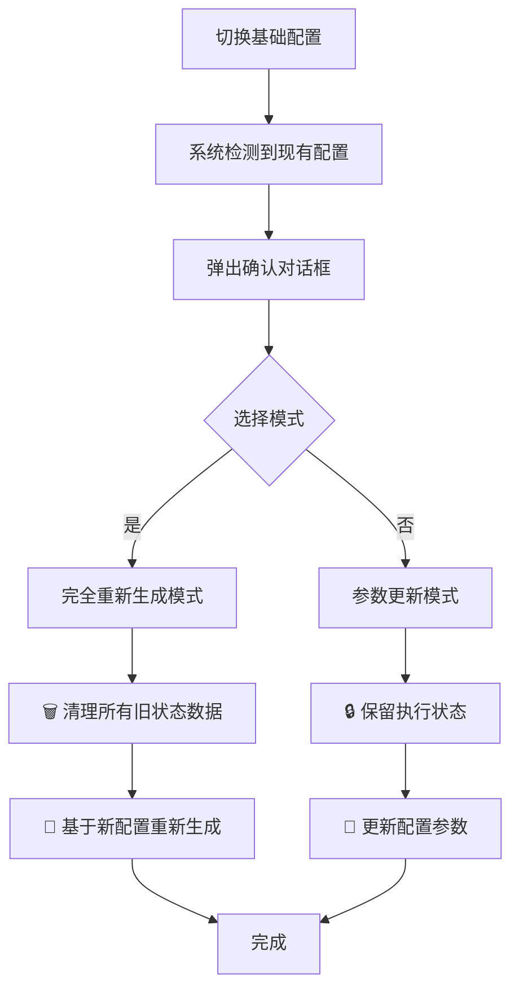

# 🎉 基础配置切换状态清理功能完成总结

## 📋 需求背景

**用户需求**：
> "当我切换基础配置，要删除原来的状态数据，然后重新生成新的状态数据。"

这是一个重要的功能需求，因为不同的基础配置可能有不同的阶梯数量、触发金额等，旧的状态数据可能不再适用新配置。

## 🔧 实现方案

### 核心功能增强

**文件**：`Views/AutoMonitorConfigWindowSimple.xaml.cs`

#### 1. 新增状态清理方法

```csharp
/// <summary>
/// 🗑️ 完全清理所有旧状态数据（基础配置切换时使用）
/// </summary>
private async Task ClearAllOldStateDataAsync()
{
    // 1. 清理统一状态管理器中的所有合约状态
    _autoMonitorService.ClearContractStates(symbol: null, positionSide: null, reason: "基础配置切换清理");
    
    // 2. 清理统一状态文件中的所有数据
    var emptyStates = new Dictionary<string, ContractMonitoringState>();
    _stateService.SaveMonitoringStates(emptyStates);
    
    // 3. 清理UI中的合约配置
    ContractConfigs.Clear();
    
    // 4. 清理相关缓存和临时数据
}
```

#### 2. 增强重新生成逻辑

**修改前**：直接重新生成，没有明确的清理步骤
```csharp
// 🎯 使用统一状态服务生成contract_monitoring_states.json
var monitoringStates = _stateService.GenerateMonitoringStatesFromPositions(activePositions, _currentConfig.Name);
```

**修改后**：两步式清理和重新生成
```csharp
// 🗑️ 【新增】步骤1：完全清理所有旧状态数据
await ClearAllOldStateDataAsync();

// 🔄 步骤2：基于新配置重新生成状态数据
var monitoringStates = _stateService.GenerateMonitoringStatesFromPositions(activePositions, _currentConfig.Name);
```

#### 3. 优化用户界面

**原对话框**：
```
"✅ 是 - 完全重新生成配置（丢弃所有执行状态，从头开始）"
"❌ 否 - 更新配置参数（保留现有执行状态，只更新金额等参数）"
```

**新对话框**：
```
"✅ 是 - 完全重新生成配置
   • 🗑️ 删除所有旧状态数据（执行状态、触发记录等）
   • 🔄 基于新配置重新生成干净的状态数据
   • 适用于：配置差异很大，需要重新开始

❌ 否 - 更新配置参数
   • 🔒 保留现有执行状态和触发记录
   • 🔄 只更新配置参数（金额、阶梯等）
   • 适用于：微调配置，保持执行历史"
```

## ✅ 功能特性

### 🗑️ 完全清理模式（选择"是"）

**清理范围**：
- ✅ 统一状态管理器中的所有合约状态
- ✅ 统一状态文件（contract_monitoring_states.json）中的所有数据
- ✅ UI界面中的合约配置显示
- ✅ 相关缓存和临时数据

**重新生成**：
- ✅ 基于新基础配置重新生成合约状态
- ✅ 所有执行状态重置为"未触发"
- ✅ 触发金额更新为新配置的值
- ✅ 基础配置名更新为新配置

### 🔒 参数更新模式（选择"否"）

**保留数据**：
- ✅ 保留所有执行状态（已执行的保持已执行）
- ✅ 保留触发记录和执行历史
- ✅ 保留冷却期状态

**更新内容**：
- ✅ 更新配置参数（金额、阶梯设置等）
- ✅ 更新基础配置名引用
- ✅ 保持状态一致性

## 📊 操作流程

### 用户操作流程



### 系统处理流程

**完全重新生成模式**：
```
1. 🗑️ 开始清理所有旧状态数据
   ├── 🧹 清理自动监控服务中的所有合约状态
   ├── 🧹 清理统一状态文件中的所有数据
   ├── 🧹 清理UI中的合约配置
   └── 🧹 清理相关缓存和临时数据

2. 🔄 基于新配置重新生成状态数据
   ├── 📊 获取活跃持仓
   ├── 🎯 生成新的监控状态
   ├── 💾 保存到状态文件
   └── 🔄 更新UI显示
```

## 🧪 验证方法

使用验证脚本：`🔧基础配置切换状态清理功能验证脚本.bat`

### 关键验证点

**状态清理验证**：
- ✅ 日志显示："🗑️ 开始清理所有旧状态数据"
- ✅ 日志显示："🧹 清理自动监控服务中的所有合约状态"
- ✅ 日志显示："🧹 清理统一状态文件中的所有数据"
- ✅ 日志显示："✅ 所有旧状态数据清理完成"

**重新生成验证**：
- ✅ 日志显示："🔄 步骤2：基于新配置重新生成状态数据"
- ✅ 状态文件中所有 `executionState` 为 0
- ✅ 状态文件中所有 `isExecuted` 为 false
- ✅ 状态文件中 `baseConfigName` 为新配置名

## 📈 使用场景

### 适合"完全重新生成"的情况

1. **配置差异很大**
   - 阶梯数量发生变化（3个→4个，4个→2个）
   - 金额设置大幅调整（风险策略变化）
   - 策略类型改变（保守→激进）

2. **需要重新开始**
   - 想清除所有执行历史
   - 测试新配置的效果
   - 解决状态数据混乱问题

3. **特殊情况**
   - 新配置与旧配置不兼容
   - 系统升级后的配置迁移
   - 重大策略调整

### 适合"更新配置参数"的情况

1. **微调配置**
   - 轻微调整触发金额
   - 修改止损比例
   - 调整保护金额

2. **保持连续性**
   - 希望保留执行历史
   - 连续性策略调整
   - 避免重复触发已执行的操作

## 🚨 注意事项

### 操作前准备

1. **数据备份**：切换前备份 `contract_monitoring_states.json`
2. **执行时机**：建议在市场相对平静时进行
3. **配置验证**：确保新配置已正确设置

### 操作后检查

1. **状态验证**：确认状态文件内容正确
2. **界面检查**：确认UI显示与文件一致
3. **功能测试**：验证新配置是否按预期工作
4. **日志监控**：关注后续运行日志

## 🎯 优势特性

### 🔒 数据安全

- ✅ **完整清理**：确保旧数据不会干扰新配置
- ✅ **原子操作**：清理和重新生成在同一个事务中
- ✅ **错误处理**：清理失败时不会留下不一致状态

### 🚀 用户体验

- ✅ **明确选择**：清楚地说明两种模式的区别
- ✅ **详细日志**：完整记录操作过程
- ✅ **即时反馈**：操作结果立即可见

### 🔧 系统稳定

- ✅ **状态一致**：避免新旧配置数据混合
- ✅ **兼容性好**：不影响现有的参数更新模式
- ✅ **向后兼容**：保持现有API不变

## 📊 影响范围

- ✅ **功能增强**：增加了完全清理和重新生成的能力
- ✅ **用户体验**：提供更清晰的操作选择
- ✅ **数据完整性**：确保配置切换时的数据一致性
- ✅ **系统稳定性**：避免旧数据对新配置的干扰

这个功能完美满足了您的需求，让您能够在切换基础配置时选择是否删除旧状态数据并重新生成新的状态数据。 