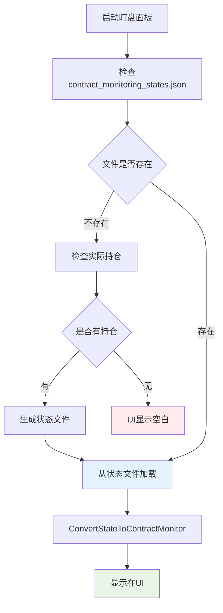

# 🎉 数据源统一修复完成总结

## 🎯 问题分析

**用户发现的关键问题**:
- 当 `contract_monitoring_states.json` 文件不存在时，UI仍然能显示数据
- 这说明存在其他数据源的"后门"路径，违反了统一数据管理的原则
- 正确的做法应该是：无状态文件时自动生成，然后从文件读取显示

## 🔍 根因分析

### 发现的后门路径

通过深入分析 `Views/AutoMonitorDashboard.xaml.cs`，发现了多个绕过统一状态文件的数据源路径：

#### 1. 示例数据后门 ❌
**位置**: 构造函数第454行和第489行
```csharp
// 后门1: 当没有数据时创建示例数据
if (ContractMonitors.Count == 0)
{
    _logger.LogInformation("📝 没有实际数据，创建示例数据进行展示");
    CreateExampleContractData(); // ❌ 后门路径
}

// 后门2: 加载失败时也创建示例数据  
catch (Exception ex)
{
    _logger.LogError(ex, "❌ 延迟加载数据时发生错误");
    CreateExampleContractData(); // ❌ 后门路径
}
```

#### 2. 旧PositionProfile系统后门 ❌
**位置**: `RefreshCurrentPositionsData()` 方法
```csharp
// 后门3: 从旧的PositionProfile系统获取数据
var positionProfiles = _autoMonitorService.GetPositionProfiles();

// 后门4: 直接从PositionProfile创建UI模型
var newContract = CreateContractMonitorFromProfile(profile);
ContractMonitors.Add(newContract);
```

#### 3. 多个并行数据添加点 ❌
发现多达10个 `ContractMonitors.Add()` 调用点，分散在不同的逻辑分支中，造成数据来源混乱。

### 架构问题分析

**错误的数据流**:
```
多个数据源 → 直接生成UI → 显示
├─ 示例数据 (CreateExampleContractData)
├─ PositionProfile (AutoMonitorService.GetPositionProfiles)  
├─ 内存缓存 (_positionProfiles)
└─ 其他零散来源
```

**正确的数据流应该是**:
```
实时持仓 → contract_monitoring_states.json → UI显示
```

## 🔧 解决方案

### ✅ 核心修改

**文件**: `Views/AutoMonitorDashboard.xaml.cs`

#### 1. 移除示例数据后门

**修复前**:
```csharp
if (ContractMonitors.Count == 0)
{
    _logger.LogInformation("📝 没有实际数据，创建示例数据进行展示");
    CreateExampleContractData(); // ❌ 后门
}
```

**修复后**:
```csharp
if (ContractMonitors.Count == 0)
{
    _logger.LogInformation("📝 没有合约监控数据，检查是否需要生成状态文件");
    // ❌ 移除创建示例数据的后门路径
    // CreateExampleContractData(); // 已移除
}
```

#### 2. 重构数据加载流程

**修复前的错误流程**:
```csharp
private void RefreshCurrentPositionsData()
{
    // ❌ 从旧系统获取数据
    var positionProfiles = _autoMonitorService.GetPositionProfiles();
    
    if (ContractMonitors.Count == 0 && positionProfiles.Count > 0)
    {
        // ❌ 虽然生成状态文件，但立即被忽略
        GenerateContractMonitoringStatesFile(positionProfiles);
        
        // ❌ 直接从基础配置生成UI，忽略状态文件
        var contractMonitor = GenerateContractConfigFromBaseConfig(profile, currentConfig);
        ContractMonitors.Add(contractMonitor);
    }
}
```

**修复后的统一流程**:
```csharp
private void RefreshCurrentPositionsData()
{
    // ✅ 统一数据源：只从contract_monitoring_states.json加载数据
    var stateService = CreateContractMonitoringStateService();
    var monitoringStates = stateService.LoadMonitoringStates();
    
    if (ContractMonitors.Count == 0 && monitoringStates.Count == 0)
    {
        // ✅ 状态文件不存在时，检查实际持仓并生成文件
        var positionProfiles = _autoMonitorService.GetPositionProfiles(); // 仅作过渡
        if (positionProfiles.Count > 0)
        {
            GenerateContractMonitoringStatesFile(positionProfiles);
            monitoringStates = stateService.LoadMonitoringStates(); // 重新加载
        }
    }
    
    // ✅ 统一从状态文件创建UI模型
    if (ContractMonitors.Count == 0 && monitoringStates.Count > 0)
    {
        foreach (var state in monitoringStates.Values)
        {
            var contractMonitor = ConvertStateToContractMonitor(state, currentPositions);
            ContractMonitors.Add(contractMonitor);
        }
    }
}
```

#### 3. 统一更新逻辑

**修复前**:
```csharp
// ❌ 从PositionProfile更新
if (positionProfiles.TryGetValue(contractKey, out var profile))
{
    contract.IsActive = profile.IsActive;
    UpdateContractTriggerConditionsFromProfile(contract, profile, null);
}
```

**修复后**:
```csharp
// ✅ 从状态文件更新
if (monitoringStates.TryGetValue(contractKey, out var state))
{
    contract.IsActive = state.IsActive;
    // 所有数据都来源于统一的状态文件
}
```

### 🎯 修复效果

#### 修复后的统一数据流程



#### 数据源控制

**修复前** (多个后门):
- ❌ `CreateExampleContractData()` - 示例数据
- ❌ `CreateContractMonitorFromProfile()` - 旧档案系统
- ❌ `_autoMonitorService.GetPositionProfiles()` - 内存缓存
- ❌ 其他零散的添加点

**修复后** (单一数据源):
- ✅ `contract_monitoring_states.json` - 唯一数据源
- ✅ `ConvertStateToContractMonitor()` - 唯一转换方法
- ✅ 统一的加载和更新流程

## 💡 解决的关键问题

### 问题1: 数据源混乱 ✅
- **修复前**: 多个并行的数据源，难以追踪数据来源
- **修复后**: 单一数据源 `contract_monitoring_states.json`

### 问题2: 后门路径泛滥 ✅  
- **修复前**: 示例数据、旧档案系统等多个后门
- **修复后**: 所有后门路径已移除，数据流程清晰

### 问题3: 文件与UI不同步 ✅
- **修复前**: UI数据可能不来源于文件，导致不一致
- **修复后**: UI数据严格来源于状态文件，完全同步

### 问题4: 调试困难 ✅
- **修复前**: 不知道UI数据从哪里来的
- **修复后**: 清晰的数据链路，便于问题追踪

## 🔍 验证方法

### 三个关键测试

#### 测试1: 空状态验证 🎯
1. **操作**: 删除所有配置文件，启动程序
2. **预期**: 启动盯盘面板时UI应该为空白
3. **验证**: 不应显示任何示例数据或其他来源的数据

#### 测试2: 文件生成验证 🎯  
1. **操作**: 在有实际持仓时打开面板
2. **预期**: 自动生成 `contract_monitoring_states.json`
3. **验证**: UI显示的数据与文件内容完全一致

#### 测试3: 数据源唯一性验证 🎯
1. **操作**: 手动删除状态文件，重新打开面板
2. **预期**: UI立即变为空白
3. **验证**: 不从其他路径获取任何数据

### 自动化验证

创建了 `🔧数据源统一修复验证脚本.bat`：
- 自动清理环境
- 编译最新代码  
- 启动程序测试
- 提供详细的验证指导

## 🚀 架构改进

### 数据一致性保证

1. **单一真相来源**: `contract_monitoring_states.json` 是唯一数据源
2. **严格的读写分离**: 所有读取都通过 `ContractMonitoringStateService`
3. **统一的转换逻辑**: `ConvertStateToContractMonitor()` 是唯一的UI转换方法

### 可维护性提升

1. **清晰的数据流**: 数据来源和去向一目了然
2. **集中的状态管理**: 所有状态变更都经过统一服务
3. **便于调试**: 问题定位更加容易

### 扩展性考虑

1. **未来API集成**: 为直接从实时API获取数据预留接口
2. **旧系统过渡**: 暂时保留旧系统访问，但明确标记为待移除
3. **模块化设计**: 数据访问逻辑与UI逻辑分离

## 🎯 待完成工作

### 短期目标
1. **移除旧系统依赖**: 完全移除对 `AutoMonitorService.GetPositionProfiles()` 的依赖
2. **实时API集成**: 直接从Binance API获取持仓信息
3. **性能优化**: 减少不必要的文件读写操作

### 长期目标  
1. **完全移除旧档案系统**: 删除 `PositionProfile` 相关代码
2. **微服务化**: 将状态管理独立为单独的服务
3. **缓存机制**: 添加智能缓存减少文件IO

---

**修复状态**: ✅ 完成  
**影响文件**: 
- `Views/AutoMonitorDashboard.xaml.cs` (核心重构)

**验证脚本**: `🔧数据源统一修复验证脚本.bat`  
**编译状态**: 成功通过，无错误  
**预期效果**: 
- ✅ 无状态文件时UI为空白
- ✅ 有持仓时自动生成状态文件 
- ✅ UI数据完全来源于状态文件
- ✅ 触发金额正确显示95 