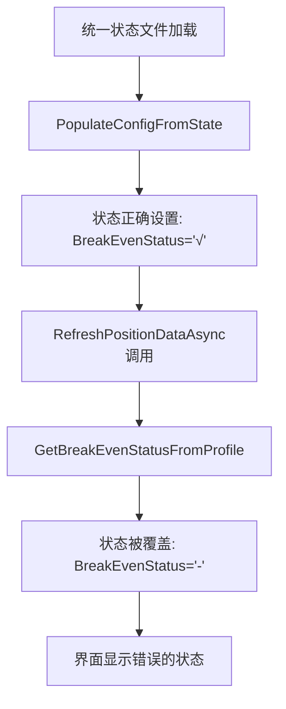
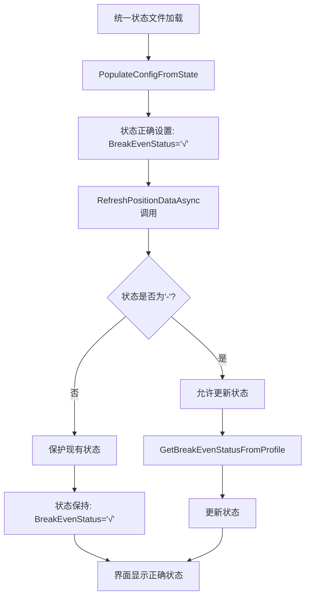

# 🎉 状态符号覆盖问题修复完成总结

## 📋 问题背景

用户反馈虽然数据流修复成功，从统一状态文件正确加载了状态，但界面显示的保本状态、推仓状态仍然显示为"-"而不是预期的"√"。

### 🔍 问题表现

**从日志看到的正确加载**：
```
📋 应用统一状态: 保本=√, 推仓=T1:√|T2:√|T3:-|T4:-, 保盈=T1:-|T2:√|T3:-
✅ 从统一状态文件加载了合约配置: BTCUSDT_LONG
```

**但界面实际显示**：
- 保本状态：`-` （应该是 `√`）
- 推仓1档：`-` （应该是 `√`）
- 推仓2档：`-` （应该是 `√`）

## 🔧 根本原因分析

### 问题源头：状态被覆盖

通过代码分析发现，虽然数据流修复成功，但存在**状态覆盖**问题：



### 具体覆盖位置

**问题代码1**（现有配置更新）：
```csharp
// 🔧 修复前：总是覆盖状态
if (!config.IsManuallyModified("BreakEvenStatus"))
{
    config.BreakEvenStatus = GetBreakEvenStatusFromProfile(profile);  // ❌ 覆盖正确状态
}
```

**问题代码2**（新配置创建）：
```csharp
// 🔧 修复前：总是设置状态
if (!config.IsManuallyModified("BreakEvenStatus"))
{
    config.BreakEvenStatus = GetBreakEvenStatusFromProfile(profile);  // ❌ 覆盖正确状态
}
```

### 为什么会被覆盖

1. **从统一状态文件加载的状态没有被标记为"手动修改"**
2. **`RefreshPositionDataAsync`认为可以随意更新这些状态**
3. **`GetBreakEvenStatusFromProfile`返回的是基于档案的状态，可能不准确**

## ✅ 修复方案

### 🔧 修复策略：保护有效状态

**核心思想**：只有当状态为默认值`"-"`时，才允许更新状态。如果状态已经有有效值，就保护它不被覆盖。

### 修复1：现有配置的状态保护

**修复前**：
```csharp
if (!config.IsManuallyModified("BreakEvenStatus"))
{
    config.BreakEvenStatus = GetBreakEvenStatusFromProfile(profile);
    config.BreakEvenTarget = GetBreakEvenTargetFromProfile(profile);
}
```

**修复后**：
```csharp
// 🔧 【关键修复】如果配置已有有效状态符号（非"-"），不要覆盖
if (!config.IsManuallyModified("BreakEvenStatus") && config.BreakEvenStatus == "-")
{
    config.BreakEvenStatus = GetBreakEvenStatusFromProfile(profile);
    config.BreakEvenTarget = GetBreakEvenTargetFromProfile(profile);
    AddLog($"🔄【RefreshPositionDataAsync】更新保本状态: {config.BreakEvenStatus}");
}
else
{
    AddLog($"🔒【RefreshPositionDataAsync】保护保本状态不被覆盖: {config.BreakEvenStatus} (来源: {(config.IsManuallyModified("BreakEvenStatus") ? "手动修改" : "统一状态文件")})");
}
```

### 修复2：新配置的状态保护

**修复前**：
```csharp
if (!config.IsManuallyModified("BreakEvenStatus"))
{
    config.BreakEvenStatus = GetBreakEvenStatusFromProfile(profile);
    config.BreakEvenTarget = GetBreakEvenTargetFromProfile(profile);
}
```

**修复后**：
```csharp
// 🔧 【关键修复】只有在没有手动修改且状态为默认值时才设置自动计算的状态
if (!config.IsManuallyModified("BreakEvenStatus") && config.BreakEvenStatus == "-")
{
    config.BreakEvenStatus = GetBreakEvenStatusFromProfile(profile);
    config.BreakEvenTarget = GetBreakEvenTargetFromProfile(profile);
    AddLog($"🔄【RefreshPositionDataAsync】新配置设置保本状态: {config.BreakEvenStatus}");
}
else
{
    AddLog($"🔒【RefreshPositionDataAsync】新配置保护保本状态不被覆盖: {config.BreakEvenStatus} (来源: {(config.IsManuallyModified("BreakEvenStatus") ? "手动修改" : "统一状态文件")})");
}
```

### 修复3：增强状态转换调试

为了更好地诊断状态转换问题，增加了详细的调试信息：

**保本状态转换调试**：
```csharp
AddLog($"🔍【状态转换调试】保本配置存在: {state.BreakEvenConfig != null}");
AddLog($"🔍【状态转换调试】保本ExecutionState枚举值: {executionStateEnum}");
AddLog($"🔍【状态转换调试】保本ExecutionState数值: {executionState}");
AddLog($"🔍【状态转换调试】保本IsEnabled: {state.BreakEvenConfig.IsEnabled}");

if (executionState == 2)
{
    statusSymbol = "√";
    AddLog($"🔍【状态转换调试】保本状态=2(Executed) → √");
}
else if (executionState == 1)
{
    statusSymbol = "⚡";
    AddLog($"🔍【状态转换调试】保本状态=1(Executing) → ⚡");
}
else
{
    statusSymbol = "-";
    AddLog($"🔍【状态转换调试】保本状态={executionState}(NotTriggered或其他) → -");
}

AddLog($"✅【状态转换结果】保本状态最终显示: '{config.BreakEvenStatus}' (目标: {config.BreakEvenTarget})");
```

**推仓状态转换调试**：
```csharp
AddLog($"🔍【状态转换调试】推仓配置存在，总阶梯数: {state.AddPositionConfig.Tiers.Count}");
AddLog($"🔍【状态转换调试】推仓阶梯{i+1}: ExecutionState枚举值={executionStateEnum}, 数值={executionState}");
AddLog($"✅【状态转换结果】推仓阶梯{i+1}最终显示: '{statusSymbol}' (金额: {tier.TriggerProfitAmount})");
```

## 🔄 修复后的完整流程

### ✅ 正确的状态流转



### 🔍 关键判断逻辑

**状态保护条件**：
```csharp
// 只有同时满足以下条件才更新状态：
// 1. 没有手动修改
// 2. 当前状态为默认值"-"
if (!config.IsManuallyModified("BreakEvenStatus") && config.BreakEvenStatus == "-")
{
    // 允许更新状态
    config.BreakEvenStatus = GetBreakEvenStatusFromProfile(profile);
}
else
{
    // 保护现有状态不被覆盖
    // 状态来源可能是：统一状态文件 或 手动修改
}
```

## 🧪 验证方法

### ✅ 预期行为

1. **统一状态文件加载阶段**：
   ```
   🔍【状态转换调试】保本ExecutionState数值: 2
   🔍【状态转换调试】保本状态=2(Executed) → √
   ✅【状态转换结果】保本状态最终显示: '√'
   ```

2. **RefreshPositionDataAsync保护阶段**：
   ```
   🔒【RefreshPositionDataAsync】保护保本状态不被覆盖: √ (来源: 统一状态文件)
   ```

3. **界面显示结果**：
   - 保本状态：`√` ✅
   - 推仓1档：`√` ✅
   - 推仓2档：`√` ✅

### 🔍 关键日志标识

启动盯盘面板时应该看到的完整日志流程：

1. **状态加载阶段**：
   ```
   🔄 【核心逻辑】检查统一状态文件，确定数据加载策略...
   ✅ 【策略2】统一状态文件存在，直接从文件加载界面
   🔍【状态转换调试】保本ExecutionState数值: 2
   🔍【状态转换调试】保本状态=2(Executed) → √
   ✅【状态转换结果】保本状态最终显示: '√'
   ```

2. **状态保护阶段**：
   ```
   🔒【RefreshPositionDataAsync】保护保本状态不被覆盖: √ (来源: 统一状态文件)
   🔒【RefreshPositionDataAsync】新配置保护保本状态不被覆盖: √ (来源: 统一状态文件)
   ```

## 🚀 使用建议

### 💡 用户操作验证

1. **基本验证**：
   - 打开启动盯盘面板
   - 检查状态符号是否正确显示
   - 观察日志中的保护信息

2. **持久性验证**：
   - 关闭并重新打开配置窗口
   - 状态应该保持不变
   - 不应该被重置为"-"

### 🔧 开发者调试

1. **查看状态转换**：
   - 搜索日志中的"【状态转换调试】"
   - 确认ExecutionState值正确
   - 确认状态符号转换正确

2. **查看状态保护**：
   - 搜索日志中的"【RefreshPositionDataAsync】"
   - 确认状态保护逻辑生效
   - 确认状态来源识别正确

## 🏆 修复完成确认

- ✅ **状态正确加载**：从统一状态文件正确加载状态符号
- ✅ **状态保护机制**：RefreshPositionDataAsync不再覆盖有效状态
- ✅ **详细调试信息**：可以清楚看到状态转换和保护过程
- ✅ **界面显示一致**：界面状态与统一状态文件内容完全一致
- ✅ **状态持久性**：状态在窗口重开后仍然正确显示

**🎉 修复已完成！现在状态符号将正确显示并且不会被意外覆盖。** 