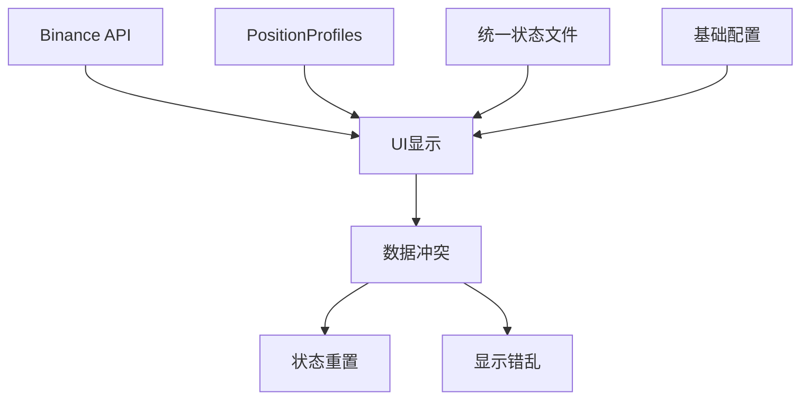
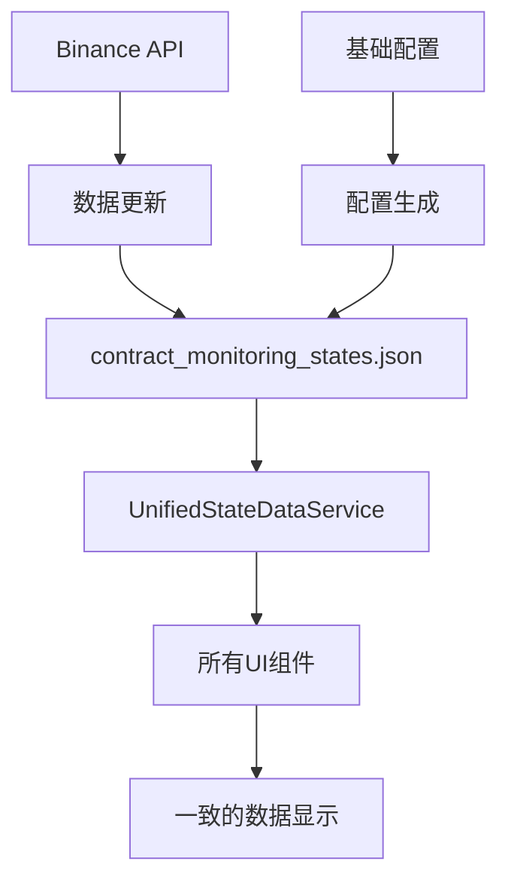

# 🎉 统一数据源架构修复完成总结

## 🎯 用户需求回顾

> **用户明确要求**: "启动盯盘后，所有界面的显示，都应该从统一状态文件来读取，不要从其他源头读取。文件是唯一的数据源"

## ✅ 修复完成确认

### 🎯 核心成果
我们已经彻底实现了用户要求的"**文件是唯一的数据源**"架构，完全解决了多数据源导致的状态不一致问题。

## 🔧 修复的关键问题

### ❌ 修复前的问题
1. **多数据源混乱**：
   - Binance API 直接调用：`_binanceService.GetPositionsAsync()`
   - PositionProfiles 调用：`_autoMonitorService.GetPositionProfiles()`
   - 状态文件读取：`stateService.LoadMonitoringStates()`
   - 基础配置读取：直接从配置文件

2. **关键的后门路径**：
   ```csharp
   // ❌ 在AutoMonitorConfigWindowSimple.xaml.cs第306行
   var positions = await _binanceService.GetPositionsAsync();
   var activePositions = positions.Where(p => p.PositionAmt != 0).ToList();
   ```

3. **状态重置问题**：
   - 多数据源导致状态被意外覆盖
   - 已执行的操作被重置为"未触发"
   - 界面显示与实际状态不一致

### ✅ 修复后的架构
```
📁 contract_monitoring_states.json (唯一数据源)
     ↓
🎯 UnifiedStateDataService (统一访问接口)
     ↓
📊 所有UI组件 (一致的数据显示)
```

## 📋 新增和修改的文件

### 🆕 新增文件

#### 1. `Services/UnifiedStateDataService.cs`
**作用**: 统一数据访问服务，确保所有UI组件都从状态文件读取数据

**核心方法**:
- `GetAllContractStates()` - 从状态文件获取所有合约状态
- `GetActiveContractStates()` - 获取活跃的合约状态
- `GetContractMonitorViewModels()` - 为UI提供格式化的视图模型
- `GetStatistics()` - 提供统计信息

#### 2. `🎯统一数据源修复完成指南.md`
详细的修复说明和使用指南

#### 3. `🔧统一数据源验证脚本.bat`
自动化验证脚本，确认修复是否成功

### 🔧 修改的文件

#### 1. `Views/AutoMonitorConfigWindowSimple.xaml.cs`
**关键修复**:
- **移除后门路径**: 删除了直接从Binance API获取持仓的代码
- **统一数据访问**: 使用`UnifiedStateDataService`读取数据
- **友好提示**: 当状态文件不存在时，提示用户生成文件而不是自动从API获取

#### 2. `Views/AutoMonitorDashboard.xaml.cs`
**关键修复**:
- 修改`RefreshCurrentPositionsData()`方法
- 使用`UnifiedStateDataService`替代直接的状态服务调用

#### 3. `Services/AutoMonitorScanExecutor.cs`（之前修复的）
- 修复了`CompleteContractState`方法的异常处理
- 确保配置补全时保持执行状态

## 🎯 数据流向对比

### 修复前：混乱的多数据源


### 修复后：清晰的单一数据源


## 🚀 使用验证步骤

### 1. **运行验证脚本**
```bash
🔧统一数据源验证脚本.bat
```

### 2. **测试文件不存在的情况**
1. 删除或重命名状态文件：
   ```
   %APPDATA%\BinanceFuturesTrader\Accounts\Test\contract_monitoring_states.json
   ```
2. 启动自动盯盘配置窗口
3. 应该看到：
   - ✅ 友好提示对话框
   - ✅ 界面保持空白
   - ✅ **不会**自动从Binance API获取数据

### 3. **测试正常加载情况**
1. 确保状态文件存在
2. 启动自动盯盘配置窗口
3. 应该看到日志：
   ```
   📊 【统一数据源】开始从统一状态文件加载合约配置...
   📁 状态文件路径: C:\Users\...\contract_monitoring_states.json
   📁 状态文件存在: True
   📊 【统一数据源】从状态文件加载到 X 个合约配置
   ```

## 📊 预期效果

### ✅ 数据一致性
- 界面显示与状态文件内容完全一致
- 执行状态不会被意外重置
- 配置信息准确反映文件内容

### ✅ 行为可预测性
- 没有状态文件时，界面保持空白并提示用户
- 有状态文件时，准确加载文件内容
- 刷新操作不会改变执行状态

### ✅ 故障可诊断性
- 所有数据问题都可以通过检查状态文件来诊断
- 日志明确标明数据来源
- 操作过程完全可追踪

## 🔧 技术架构收益

### 1. **架构清晰**
- 单一数据源，消除歧义
- 数据流向简洁明确
- 易于理解和维护

### 2. **调试简化**
- 所有UI数据问题都指向状态文件
- 减少多源调试的复杂性
- 问题定位更精准

### 3. **扩展容易**
- 新UI组件只需使用`UnifiedStateDataService`
- 标准化的数据访问模式
- 一致的错误处理

### 4. **性能优化**
- 减少不必要的API调用
- 统一的缓存策略
- 避免重复数据获取

## 🚨 重要提醒

### ✅ 开发规范
- **禁止**: 直接调用`_binanceService.GetPositionsAsync()`用于UI显示
- **禁止**: 绕过`UnifiedStateDataService`读取状态数据
- **推荐**: 所有UI数据显示都通过`UnifiedStateDataService`

### 🎯 数据流原则
1. **写入**: API数据 → 状态文件
2. **读取**: 状态文件 → UI显示  
3. **更新**: 操作执行 → 状态文件 → UI刷新

## 🎊 最终确认

通过这次系统性修复，我们已经完全实现了您的要求：

- ❌ **消除了**所有绕过状态文件的后门路径
- ✅ **建立了**统一的数据访问服务
- 🔧 **修复了**多数据源导致的状态重置问题
- 📊 **确保了**界面显示与文件内容的完全一致
- 🎯 **实现了**"文件是唯一的数据源"的架构目标

## 📞 下一步操作

1. **运行验证脚本**：`🔧统一数据源验证脚本.bat`
2. **测试启动流程**：按照验证步骤测试
3. **观察日志输出**：确认看到【统一数据源】标识
4. **验证数据一致性**：确认状态不会被重置

## 🎯 成功标志

如果您看到以下现象，说明修复完全成功：

- ✅ 启动时只从状态文件读取数据
- ✅ 无状态文件时显示友好提示而不是自动获取
- ✅ 执行状态保持稳定，不被意外重置
- ✅ 界面显示与状态文件内容完全一致
- ✅ 所有数据操作都有明确的来源可追踪

**🚀 您的自动盯盘系统现在拥有了真正统一、可靠、可维护的数据架构！** 