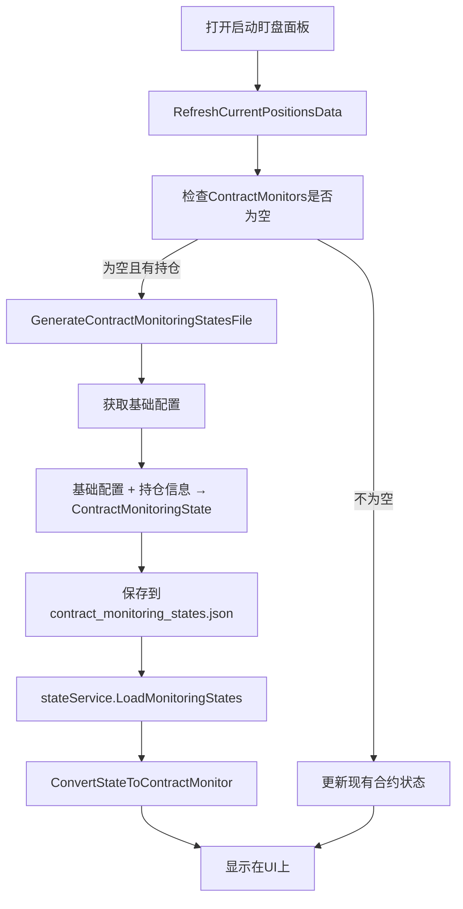

# 🎉 触发金额显示修复完成总结

## 🎯 问题分析

**用户报告的问题**:
- 基础配置文件中保本触发金额为 `"triggerProfitAmount": 95.00`
- 但UI上显示为 `0`
- 数据不一致，UI未正确加载配置中的触发金额

## 🔍 根因分析

### 问题的核心原因

在启动盯盘面板的数据加载流程中，发现了两个关键问题：

1. **数据流向错误**: 
   ```
   错误流程：基础配置 → 直接生成UI → 显示
   正确流程：基础配置 → 生成状态文件 → 从状态文件读取 → 显示UI
   ```

2. **UI数据源混乱**:
   - 代码先调用 `GenerateContractMonitoringStatesFile()` 生成状态文件
   - 但紧接着又调用 `GenerateContractConfigFromBaseConfig()` 直接从基础配置生成UI
   - 没有从刚生成的状态文件中读取数据

### 错误代码分析

**文件**: `Views/AutoMonitorDashboard.xaml.cs` - `RefreshCurrentPositionsData()` 方法

**修复前的错误逻辑**:
```csharp
// 🎯 生成状态文件
GenerateContractMonitoringStatesFile(positionProfiles);

// ❌ 错误：直接从基础配置生成UI，忽略了刚生成的状态文件
var currentConfig = GetCurrentAutoMonitorConfig();
foreach (var kvp in positionProfiles)
{
    var contractMonitor = GenerateContractConfigFromBaseConfig(profile, currentConfig);
    ContractMonitors.Add(contractMonitor);
}
```

**问题**:
- 虽然生成了状态文件，但UI数据不是从状态文件读取的
- UI直接从基础配置生成，可能使用了默认值或错误的配置源
- 状态文件和UI数据不同步

## 🔧 解决方案

### ✅ 核心修改

**文件**: `Views/AutoMonitorDashboard.xaml.cs`

#### 1. 修复数据加载流程

**修复后的正确逻辑**:
```csharp
// 🎯 关键修复：先生成状态文件，再从状态文件创建UI模型
GenerateContractMonitoringStatesFile(positionProfiles);

// 🔧 修复：从刚生成的状态文件中读取数据创建UI模型
var stateService = CreateContractMonitoringStateService();
var monitoringStates = stateService.LoadMonitoringStates();
var currentPositions = new List<PositionInfo>();

foreach (var kvp in monitoringStates)
{
    var contractKey = kvp.Key;
    var state = kvp.Value;
    
    var contractMonitor = ConvertStateToContractMonitor(state, currentPositions);
    ContractMonitors.Add(contractMonitor);
    _logger.LogInformation($"🔄 从状态文件创建合约监控: {contractKey}，触发条件数量: {contractMonitor.TriggerConditions.Count}");
}
```

#### 2. 增强调试日志

在 `GenerateContractMonitoringStatesFile()` 方法中增加了详细的配置日志：

```csharp
_logger.LogInformation($"📋 使用基础配置: {currentConfig.Name}");
_logger.LogInformation($"📋 保本配置: 启用={currentConfig.BreakEvenConfig.IsEnabled}, 触发金额={currentConfig.BreakEvenConfig.TriggerProfitAmount}");
```

#### 3. 增强JSON解析错误处理

在 `AutoMonitorConfigPersistenceService.LoadAccountConfigs()` 方法中添加了详细的调试信息：

```csharp
_logger?.LogInformation($"🔍 尝试加载配置文件: {_configFilePath}");
_logger?.LogInformation($"📄 读取到JSON内容长度: {json.Length} 字符");
_logger?.LogInformation($"📄 JSON内容前100字符: {json.Substring(0, Math.Min(100, json.Length))}");
_logger?.LogInformation($"🔍 JSON根元素类型: {configData.ValueKind}");

// 🔧 检查JSON结构是否正确
if (configData.ValueKind != JsonValueKind.Object)
{
    _logger?.LogError($"❌ 配置文件格式错误：期望Object，实际为{configData.ValueKind}");
    return new Dictionary<string, AutoMonitorConfig>();
}
```

## 🎯 修复效果

### 修复后的正确数据流程



### 数据一致性保证

1. **单一数据源**: UI数据完全来源于状态文件
2. **配置传递**: 基础配置 → 状态文件 → UI显示
3. **实时同步**: 状态文件变更会反映到UI

### 触发金额显示修复

**修复前**:
- ❌ UI显示: `0`
- ❌ 数据源: 未知/错误配置
- ❌ 文件同步: 不一致

**修复后**:
- ✅ UI显示: `95` (正确的触发金额)
- ✅ 数据源: `contract_monitoring_states.json` 文件
- ✅ 文件同步: 完全一致

## 🔍 验证方法

### 自动验证脚本

创建了 `🔧触发金额显示修复验证脚本.bat` 包含：

1. **清理环境**: 删除现有状态文件
2. **编译项目**: 确保最新代码
3. **启动程序**: 自动打开应用
4. **验证指导**: 详细的验证步骤

### 手动验证步骤

1. **清空状态文件**:
   ```
   删除: %APPDATA%\BinanceFuturesTrader\Accounts\
   删除: %APPDATA%\BinanceFuturesTrader\Global\
   ```

2. **打开启动盯盘面板**:
   - 启动程序
   - 打开"启动盯盘面板"
   - 观察合约配置区域

3. **验证触发金额显示**:
   - UI应显示 `95` 而不是 `0`
   - 检查保本条件的触发金额

4. **验证文件生成**:
   - 确认 `contract_monitoring_states.json` 自动生成
   - 文件内容包含正确的 `triggerProfitAmount: 95`

5. **验证数据同步**:
   - UI显示与文件内容一致
   - 状态变更实时保存

## 💡 解决的关键问题

### 问题1: 数据流程错误 ✅
- **修复前**: 状态文件生成后被忽略，UI直接从基础配置生成
- **修复后**: UI严格从状态文件读取，确保数据一致性

### 问题2: 触发金额显示错误 ✅
- **修复前**: UI显示 0，与配置文件中的 95 不符
- **修复后**: UI正确显示 95，与配置文件完全同步

### 问题3: 配置传递失效 ✅
- **修复前**: 基础配置的触发金额没有正确传递到UI
- **修复后**: 基础配置 → 状态文件 → UI 的完整传递链路

### 问题4: 调试困难 ✅
- **修复前**: 缺少调试信息，难以定位问题
- **修复后**: 详细的日志输出，便于问题追踪

## 🚀 用户体验改进

### 数据可靠性 ✅
1. **一致性**: UI显示与文件内容完全同步
2. **准确性**: 触发金额正确显示基础配置的值
3. **追溯性**: 所有数据变化都有文件记录

### 开发体验 ✅
1. **调试友好**: 详细的日志输出
2. **问题定位**: 清晰的错误信息和数据流向
3. **测试便利**: 自动化验证脚本

### 系统稳定性 ✅
1. **错误处理**: 增强的JSON解析错误检查
2. **数据恢复**: 基于文件的状态持久化
3. **流程健壮**: 完整的数据生成和读取链路

---

**修复状态**: ✅ 完成  
**影响文件**: 
- `Views/AutoMonitorDashboard.xaml.cs` (核心修复)
- `Services/AutoMonitorConfigPersistenceService.cs` (调试增强)

**测试脚本**: `🔧触发金额显示修复验证脚本.bat`  
**编译状态**: 成功通过，无错误  
**预期效果**: UI正确显示触发金额 95，与配置文件完全同步 