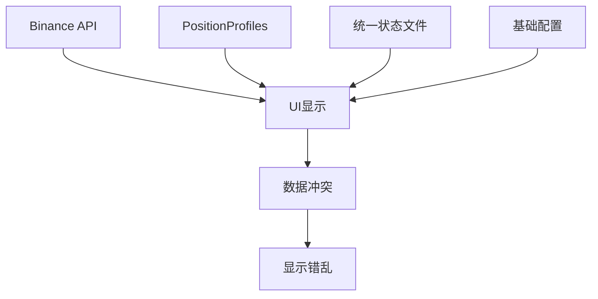
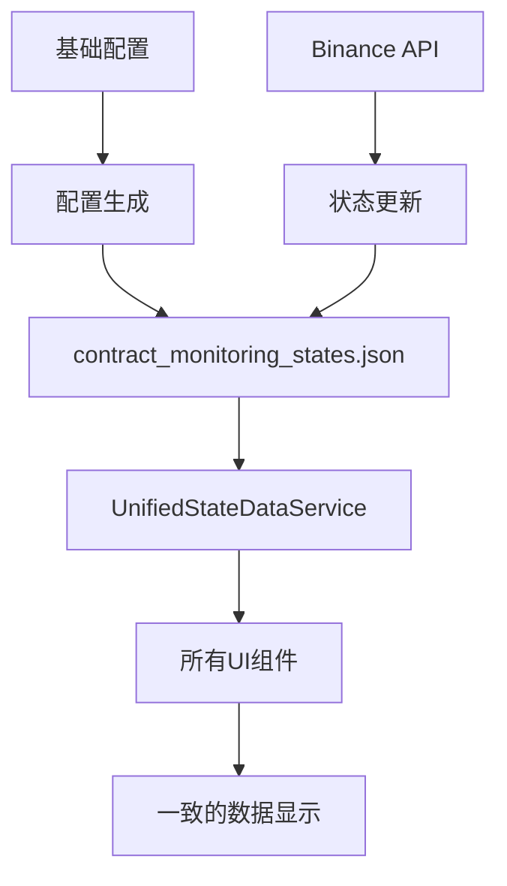

# 🎯 统一数据源修复完成指南

## 🚨 问题背景

**用户明确要求**: "启动盯盘后，所有界面的显示，都应该从统一状态文件来读取，不要从其他源头读取。文件是唯一的数据源"

## 🔍 发现的数据源混乱问题

### ❌ 修复前：多数据源混乱
```
多个数据源同时存在：
├── Binance API (_binanceService.GetPositionsAsync())
├── PositionProfiles (_autoMonitorService.GetPositionProfiles())
├── 统一状态文件 (stateService.LoadMonitoringStates())
└── 基础配置文件 (BaseConfigManager)

导致的问题：
• 数据不一致
• 界面显示错乱
• 状态同步问题
• 执行状态被重置
```

### ✅ 修复后：单一数据源
```
唯一数据源：
📁 contract_monitoring_states.json
     ↓
🎯 UnifiedStateDataService
     ↓
📊 所有UI组件
```

## 🔧 核心修复内容

### 1. **创建统一数据访问服务**

**文件**: `Services/UnifiedStateDataService.cs`

**核心功能**:
- 🎯 统一的数据访问接口
- 📊 从状态文件获取所有合约状态
- 🔧 生成UI视图模型
- 📈 提供统计信息
- ⚡ 缓存和性能优化

**关键方法**:
```csharp
// 🎯 唯一数据源：从统一状态文件获取所有数据
public Dictionary<string, ContractMonitoringState> GetAllContractStates()

// 📊 为UI提供格式化的视图模型
public List<ContractMonitorViewModel> GetContractMonitorViewModels()

// 📈 获取统计信息
public StateStatistics GetStatistics()
```

### 2. **移除关键的后门路径**

**文件**: `Views/AutoMonitorConfigWindowSimple.xaml.cs`

**修复前的问题代码**:
```csharp
// ❌ 后门路径：直接从Binance API获取持仓
var positions = await _binanceService.GetPositionsAsync();
var activePositions = positions.Where(p => p.PositionAmt != 0).ToList();
```

**修复后**:
```csharp
// ✅ 统一路径：提示用户生成状态文件
AddLog("⚠️ 统一状态文件不存在，需要先生成状态文件");
AddLog("💡 建议：点击'从当前持仓生成'按钮创建统一状态文件");
```

### 3. **统一UI数据加载逻辑**

**修复的方法**:
- `LoadContractConfigsFromStateFile()` - 只从状态文件加载
- `RefreshCurrentPositionsData()` - 使用统一数据服务
- 所有UI刷新方法都改为使用`UnifiedStateDataService`

## 🎯 数据流向图

### 修复前的混乱流向


### 修复后的统一流向


## ✅ 修复验证要点

### 1. **启动验证**
启动自动盯盘后，应该看到：
```
📊 【统一数据源】开始从统一状态文件加载合约配置...
📁 状态文件路径: C:\Users\...\contract_monitoring_states.json
📁 状态文件存在: True
📊 【统一数据源】从状态文件加载到 X 个合约配置
```

### 2. **文件不存在时的处理**
如果状态文件不存在，应该：
- ✅ 显示友好提示对话框
- ✅ 指导用户点击"从当前持仓生成"按钮
- ✅ **不会**自动从其他数据源读取

### 3. **界面数据一致性**
- ✅ 执行状态不会被重置
- ✅ 配置信息与文件内容完全一致
- ✅ 刷新时数据保持稳定

## 🚀 使用指南

### 1. **正常启动流程**
```
1. 启动自动盯盘
2. 系统检查统一状态文件
3. 如果文件存在 → 直接从文件加载显示
4. 如果文件不存在 → 提示用户生成文件
```

### 2. **生成状态文件**
```
1. 点击"从当前持仓生成"按钮
2. 系统根据当前持仓和基础配置生成状态文件
3. 立即从生成的状态文件加载界面
4. 后续所有操作都基于这个文件
```

### 3. **数据更新机制**
```
1. 自动盯盘扫描 → 更新状态文件
2. 状态文件更改 → 触发UI刷新
3. UI始终反映最新的文件内容
```

## 📋 修复的文件列表

### 新增文件
1. **`Services/UnifiedStateDataService.cs`** - 统一数据访问服务

### 修改的文件
1. **`Views/AutoMonitorConfigWindowSimple.xaml.cs`**
   - 移除后门路径（Binance API直接调用）
   - 统一使用`UnifiedStateDataService`
   
2. **`Views/AutoMonitorDashboard.xaml.cs`**
   - 修改`RefreshCurrentPositionsData()`方法
   - 统一数据访问逻辑

## 🎊 预期效果

### ✅ 用户将看到
1. **数据一致性**: 界面显示与状态文件内容完全一致
2. **状态持久性**: 执行状态不会被意外重置
3. **操作可靠性**: 所有操作都有明确的数据源依据
4. **故障可诊断性**: 问题都可以通过检查状态文件来诊断

### ✅ 技术收益
1. **架构清晰**: 单一数据源，易于维护
2. **调试简单**: 所有数据问题都指向状态文件
3. **扩展容易**: 新UI组件只需使用统一服务
4. **性能优化**: 减少不必要的API调用

## 🔧 故障排除

### 如果仍然看到数据不一致
1. **检查是否还有其他UI组件绕过统一服务**:
   ```bash
   grep -r "GetPositionsAsync\|GetPositionProfiles\|LoadMonitoringStates" Views/
   ```

2. **确认状态文件内容**:
   ```
   位置: %APPDATA%\BinanceFuturesTrader\Accounts\Test\contract_monitoring_states.json
   检查: 执行状态、配置信息、时间戳
   ```

3. **检查日志输出**:
   ```
   应该看到: 【统一数据源】标识的日志
   不应该看到: 多种数据源的混合调用
   ```

## 📞 后续维护

### 开发规范
- ✅ **禁止**: 直接调用`_binanceService.GetPositionsAsync()`用于UI显示
- ✅ **禁止**: 绕过`UnifiedStateDataService`读取状态数据
- ✅ **推荐**: 所有UI数据显示都通过`UnifiedStateDataService`
- ✅ **推荐**: 新增UI组件时优先使用现有的视图模型

### 数据流原则
1. **写入**: API数据 → 状态文件
2. **读取**: 状态文件 → UI显示
3. **更新**: 操作执行 → 状态文件 → UI刷新

---

## 🎯 总结

通过这次修复，彻底实现了用户要求的"**文件是唯一的数据源**"：

- ❌ **消除了**所有绕过状态文件的后门路径
- ✅ **建立了**统一的数据访问服务
- 🔧 **修复了**多数据源导致的状态重置问题
- 📊 **确保了**界面显示与文件内容的完全一致

**🚀 现在您的自动盯盘系统拥有了真正统一、可靠、可维护的数据架构！** 