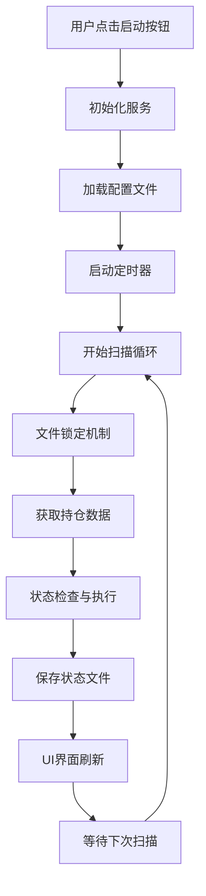

# 📋 自动盯盘启动后程序流程详解

## 🚀 流程概览



## 📝 详细流程步骤

### 🔧 阶段1: 启动初始化 (0-2秒)

#### 1.1 用户交互触发
```csharp
// MainWindow 或 AutoMonitorDashboard
用户点击 "启动自动盯盘" 按钮
↓
调用 AutoMonitorService.StartAsync()
```

#### 1.2 服务初始化
```csharp
AutoMonitorService.StartAsync()
├── 检查服务运行状态 (IsRunning = false)
├── 验证API配置完整性
├── 初始化 FileBasedStateManager
├── 初始化 AutoMonitorScanExecutor
├── 设置定时器间隔 (默认30秒)
└── 启动 System.Timers.Timer
```

#### 1.3 配置文件加载
```
📁 数据目录: %APPDATA%\BinanceFuturesTrader\AutoMonitor\
├── 🔍 读取 contract_monitoring_states.json (合约状态)
├── 🔍 读取 AutoMonitorConfigs.json (基础配置)
├── 🔍 读取 execution_history.json (执行历史)
└── 📊 初始化内存状态
```

#### 1.4 初始状态设置
```csharp
IsRunning = true
StartTime = DateTime.Now
ScanCount = 0
LastScanTime = null
UI状态更新: "启动盯盘" → "停止盯盘" (红色)
```

---

### ⏰ 阶段2: 定时扫描循环 (每30秒触发)

#### 2.1 扫描触发
```csharp
Timer.Elapsed 事件触发
↓
OnTimerElapsed(object sender, ElapsedEventArgs e)
├── 检查服务运行状态
├── 记录扫描开始时间
└── 调用 ScanExecutor.ExecuteScanCycleAsync()
```

#### 2.2 文件锁定开始 🔒
```csharp
FileBasedStateManager.ExecuteWithFileLockAsync()
├── 🔒 await _fileLock.WaitAsync() // 获取文件锁
├── 📖 LoadStatesFromFileAsync() // 读取最新状态到内存
├── 📊 states = Dictionary<string, ContractMonitoringState>
└── 🚀 开始业务逻辑处理
```

#### 2.3 持仓数据获取
```csharp
AutoMonitorScanExecutor.ExecuteScanCycleAsync()
├── 📡 调用币安API获取当前持仓
├── 🔍 var currentPositions = await GetCurrentPositionsAsync()
├── 📊 activeContractKeys = positions.Select(p => $"{p.Symbol}_{p.PositionSide}")
└── 📝 日志: "当前活跃持仓: X个"
```

#### 2.4 状态文件清理
```csharp
CleanupClosedPositions(contractStates, activeContractKeys)
├── 🔍 检查文件中的合约是否还有对应持仓
├── 🗑️ 移除已平仓的合约状态
├── 📝 日志: "移除已平仓合约: BTCUSDT_LONG"
└── 📊 确保状态文件与实际持仓同步
```

---

### 🎯 阶段3: 合约逐一处理

#### 3.1 合约状态获取或创建
```csharp
foreach (var position in currentPositions)
{
    contractKey = $"{position.Symbol}_{position.PositionSide}"
    ↓
    contractState = GetOrCreateContractState(contractStates, contractKey, position)
    ├── 🔍 检查状态文件中是否存在该合约
    ├── ✅ 存在: 返回现有状态
    └── 🆕 不存在: 创建新状态并加入文件
}
```

#### 3.2 配置文件匹配
```csharp
config = await GetContractConfigAsync(contractKey)
├── 🔍 查找合约对应的自动盯盘配置
├── ✅ 有配置: 继续执行监控逻辑
└── ⚠️ 无配置: 跳过该合约
```

#### 3.3 监控逻辑执行
```csharp
executed = await ExecuteContractMonitoringAsync(contractKey, position, config, contractState)
├── 🛡️ 检查保本条件
│   ├── ShouldExecuteBreakEven(position, config, state)
│   ├── 浮盈 >= 触发金额 && 未执行
│   └── 执行: ExecuteBreakEvenAsync() + 更新状态
├── 🚀 检查推仓条件 (4个阶梯)
│   ├── for (tier = 1; tier <= 4; tier++)
│   ├── ShouldExecuteAddPosition(position, config, state, tier)
│   └── 执行: ExecuteAddPositionAsync() + 更新状态
└── 💰 检查保盈条件 (3个阶梯)
    ├── for (tier = 1; tier <= 3; tier++)
    ├── ShouldExecuteProfitProtection(position, config, state, tier)
    └── 执行: ExecuteProfitProtectionAsync() + 更新状态
```

---

### 💾 阶段4: 状态保存与锁释放

#### 4.1 状态文件保存 🔒
```csharp
// 在锁定上下文中自动执行
SaveStatesToFileAsync(contractStates)
├── 💾 序列化状态字典为JSON
├── 📝 写入 contract_monitoring_states.json
├── 📊 包含所有合约的最新状态
└── 📝 日志: "状态已保存到文件，包含 X 个合约"
```

#### 4.2 执行历史记录
```csharp
if (hasExecuted)
{
    ExecutionHistoryRecord record = new()
    {
        ExecutionTime = DateTime.Now,
        Symbol = position.Symbol,
        ExecutionType = "保本/推仓/保盈",
        IsSuccess = true,
        TriggerPnl = position.UnrealizedPnl
    };
    ↓
    AppendExecutionHistoryAsync(record)
}
```

#### 4.3 文件锁释放 🔓
```csharp
finally
{
    _fileLock.Release();
    📝 日志: "🔒 [FILE-UNLOCK] 文件锁定释放，扫描周期完成"
}
```

#### 4.4 扫描结果统计
```csharp
ScanResult result = new()
{
    TotalPositions = currentPositions.Count,
    ProcessedCount = processedCount,
    ExecutedCount = executedCount,
    StateFileContractCount = contractStates.Count,
    ScanTime = DateTime.Now
};
📝 日志: "✅ 扫描完成 - 已处理 X/Y 个持仓，执行 Z 次操作"
```

---

### 🖥️ 阶段5: UI界面更新

#### 5.1 自动刷新触发
```csharp
// 扫描完成后触发UI刷新
NotifyUIRefreshAsync()
├── 📡 获取最新文件状态
├── 🔄 RefreshDataAsync()
└── 📊 更新监控面板显示
```

#### 5.2 界面数据刷新
```csharp
AutoMonitorDashboard.RefreshDataAsync()
├── 📖 contractStates = await _scanExecutor.GetCurrentStatesAsync()
├── 🔄 Application.Current.Dispatcher.InvokeAsync(() =>
│   ├── ContractMonitors.Clear()
│   ├── foreach (var state in contractStates)
│   │   └── ContractMonitors.Add(CreateDisplayModel(state))
│   └── UpdateStatistics()
├── 📊 更新统计卡片
│   ├── 总合约数: contractStates.Count
│   ├── 保本配置数量
│   ├── 推仓配置数量
│   └── 保盈配置数量
└── 📝 日志: "🔄 界面刷新完成，显示 X 个合约"
```

#### 5.3 状态显示格式
```
合约表格显示:
┌────────────┬────┬──────┬────────┬────────┬────────┐
│   合约     │方向│ 价格 │  盈亏  │保本状态│推仓进度│
├────────────┼────┼──────┼────────┼────────┼────────┤
│ BTCUSDT    │LONG│ 43000│ +156.2 │ 95|√   │ 2/4    │
│ ETHUSDT    │LONG│ 2580 │ +89.5  │ 50|-   │ 1/4    │
└────────────┴────┴──────┴────────┴────────┴────────┘

状态符号说明:
✓ (√) = 已执行
- = 未触发  
⏳ = 执行中
```

---

### 🔄 阶段6: 循环等待

#### 6.1 定时器重置
```csharp
// 等待下一个定时器间隔 (30秒)
Timer继续运行
├── 📊 更新扫描统计
├── ScanCount++
├── LastScanTime = DateTime.Now
└── ⏰ 准备下次扫描
```

#### 6.2 运行状态监控
```csharp
持续监控:
├── 🔍 网络连接状态
├── 📊 API调用频率限制
├── 💾 内存使用情况
├── 📁 文件访问权限
└── ⚠️ 异常处理和恢复
```

---

## 📊 关键数据流向

### 数据读取路径
```
币安API → 持仓数据 → 内存处理 → 状态文件 → UI显示
```

### 状态更新路径  
```
触发条件满足 → 执行操作 → 更新内存状态 → 保存文件 → 刷新UI
```

### 文件操作时序
```
🔒 锁定 → 📖 读取 → 🔄 处理 → 💾 保存 → 🔓 释放 → 📱 刷新UI
```

## ⚡ 性能特点

### 🔒 文件锁定机制优势
- **原子性**: 读写操作不可分割
- **一致性**: 状态文件始终保持最新
- **隔离性**: 避免并发访问冲突
- **持久性**: 异常中断后状态可恢复

### ⏰ 定时扫描优化
- **可配置间隔**: 5-60秒灵活设置
- **智能跳过**: 无配置合约自动跳过
- **批量处理**: 单次扫描处理所有持仓
- **异常隔离**: 单个合约错误不影响其他

### 📱 UI更新策略
- **事件驱动**: 扫描完成后触发刷新
- **增量更新**: 只更新变化的数据
- **线程安全**: Dispatcher确保UI线程操作
- **性能优化**: 避免过度频繁的界面刷新

## 🎯 监控要点

启动自动盯盘后，您可以通过以下方式监控运行状态：

1. **日志观察**
   - 查看 `[FILE-LOCK]` 标记确认锁定机制工作
   - 观察扫描间隔和处理时间
   - 监控执行操作的频率和结果

2. **界面检查**
   - 确认档案数量与实际持仓数量一致
   - 验证状态显示的实时性
   - 检查配置进度的准确性

3. **文件验证**
   - 查看 `contract_monitoring_states.json` 的更新时间
   - 确认文件内容与界面显示同步
   - 检查执行历史记录的完整性

这就是启动自动盯盘后的完整程序流程！每个环节都经过精心设计，确保稳定性和可靠性。🚀 